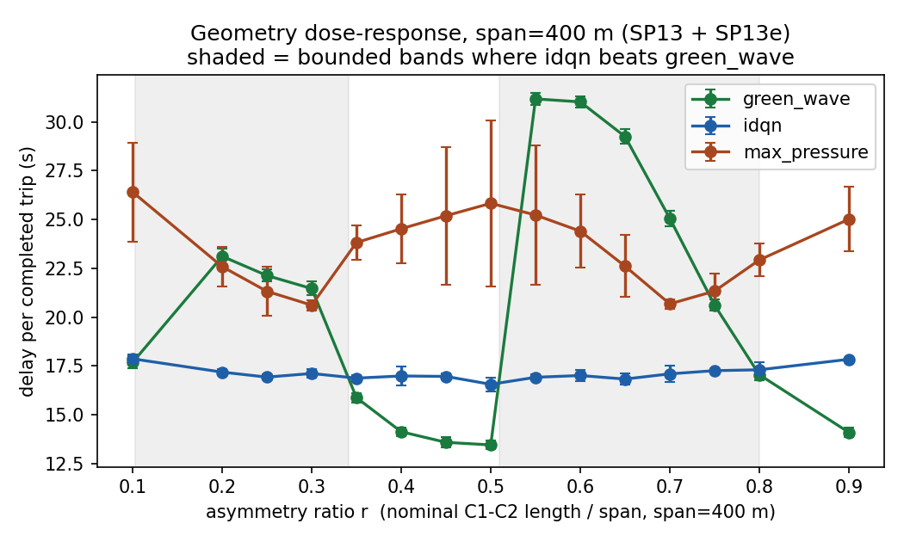
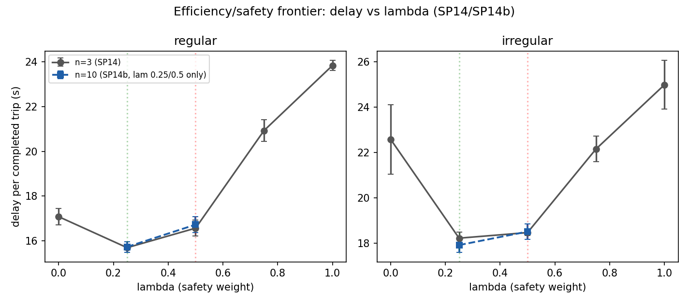

# Safety-Aware Reinforcement Learning for Heterogeneous-Traffic Signal Control

### A consolidated technical report

**Group 7 — Smart Traffic Signal Optimization for Heterogeneous Traffic**
**Report date: 2026-08-27**

---

## Abstract

This report documents an end-to-end investigation into whether reinforcement
learning (RL) can improve traffic-signal control over classical control laws,
under a traffic mix and safety objective modelled on heterogeneous,
weak-lane-discipline traffic (motorcycles, auto-rickshaws, cars) rather than
the homogeneous car-only traffic most signal-control RL literature assumes.
The project ran on the SUMO microscopic traffic simulator across two network
scales — a single isolated intersection and a three-signal arterial corridor
— comparing four RL algorithms (DQN, QR-DQN, PPO, A2C), two independent- and
coordinated-multi-agent extensions (IDQN, IPPO, MAPPO), and two classical
non-learning controllers (a coordinated fixed-time "green wave" plan and the
reactive max-pressure heuristic) across 15 numbered sub-projects (SP1–SP15b).

The headline results, in order of how strongly they are evidenced: (1) at a
single isolated intersection, a competently-timed static plan beats every RL
algorithm tried, and the reason is structural (amber loss under a
too-short minimum green), not a training failure; (2) at the corridor scale,
a fixed offset-coordinated plan ("green wave") beats every learned or
reactive controller on regularly-spaced signals, but loses to independent
DQN once signal spacing becomes asymmetric — a reversal confirmed at n=10
seeds on one irregular geometry and replicated at n=3 on two further
geometry variants, with the finer structure of *where* it reverses (two
bounded bands of the asymmetry ratio rather than a monotonic trend) resting
on a single-span, n=3 sweep and correspondingly weaker; (3) the project's
safety-weighted reward's default weight (λ=0.5) was never the
efficiency-optimal point — λ=0.25 beats it on delay on both geometries
tested, confirmed at n=10 seeds; (4) a centralised-critic multi-agent method
(MAPPO), built specifically to test this project's own coordination thesis,
does not outperform independent learning at this scale, even after one round
of hyperparameter retuning aimed at its most likely confound.

Six independent methodological defects in the project's first-stage results
were found and corrected (Section 5.1) before any of the above could be
trusted; the corrected methodology and its own limitations are disclosed
throughout.

---

## 1. Introduction — what this project is and why

### 1.1 Motivation

Traffic-signal control is one of the most-studied applications of
reinforcement learning, but the overwhelming majority of published work — and
the standard SUMO/sumo-rl tooling this project builds on — models a
homogeneous car-only traffic stream. Much of South and Southeast Asia's urban
traffic is not homogeneous: motorcycles and auto-rickshaws routinely exceed
cars in raw vehicle count, they do not queue single-file the way cars do
(they filter and "seep" to the front of a queue during red), and they carry a
categorically different crash-injury risk than an occupant of a car when a
signal-timing decision goes wrong. This project (**Group 7, "Smart Traffic
Signal Optimization for Heterogeneous Traffic"**) set out to answer two
linked questions under that traffic mix, on a SUMO simulation with
motorcycle/auto-rickshaw/car vehicle types built in from the start
(`vtypes.add.xml`):

1. Does RL improve signal control (delay, throughput) over classical
   fixed-time and reactive control, once the comparison is made fair — same
   environment, same reward, same evaluation protocol, across algorithms?
2. Does making the reward **safety-aware** — penalising hard braking and
   intersection-exposure events, weighted by how vulnerable the vehicle type
   is in a crash — change what "the best controller" means, and by how much?

A third question was added mid-project as a natural extension once the
single-intersection question was answered: **does the same comparison hold
at the scale of a coordinated multi-signal corridor**, where a classical
"green wave" fixed-offset plan has a coordination advantage no single
intersection controller can have, and where multi-agent RL (independent vs.
centralised-critic coordination) becomes a meaningful axis in its own right?

### 1.2 Method of work

The project proceeded as a sequence of **15 numbered, scoped sub-projects**
(SP1–SP15, with several sub-projects split into a primary run plus one or
more lettered follow-ups, e.g. SP13a–e), each with its own written design
spec, implementation plan, and findings document. This report is the
consolidation of that sequence; every claim below traces to a specific
findings document (`docs/FINDINGS_*.md`) or design spec
(`docs/superpowers/specs/*.md`) in the project repository, cited by filename
throughout.

### 1.3 What this report is structured to answer

Per the report brief this document was commissioned to satisfy, each of the
following sections addresses one required element explicitly:

- **Section 2** — prior/related research this project's design is built on
  or measured against, with citations, and how this project's own findings
  agree or disagree with them and why.
- **Section 3** — the data: simulated (not real-world) traffic, generated by
  SUMO from hand-authored network and demand files, with every parameter's
  source and whether it is fixed or swept.
- **Section 4** — every formula used to control or score an agent (the
  safety-aware reward, the PCU observation weighting, the green-wave offset
  plan, and the max-pressure rule), with every variable explained, whether it
  is a fixed constant or a swept/dynamic quantity, and where its value comes
  from — plus the per-algorithm hyperparameters and their provenance.
- **Section 5** — the full experimental history: every sub-project, why it
  was run, what was expected, what was found, why the result came out that
  way, and what future work each one leaves open, with citations to
  literature it drew on where applicable.
- **Section 6** — the project's bottom-line, consolidated result.
- **Section 7** — overall future work across the whole project.
- **Section 8** — individual contribution statement.
- **Appendix A** — paired per-seed differences on every headline gap
  reported in Section 5, with significance tests and confidence intervals
  where (and only where) n supports them.
- **References** — every citation used above, numbered.

---

## 2. Related work

### 2.1 The comparison methodology this project follows

The project's own founding design document states its apples-to-apples
comparison discipline is "per the Noaeen et al. 2022 reproducibility
warning" (`docs/superpowers/specs/2026-07-17-safety-aware-reward-comparison-design.md:21`).
Noaeen et al. **[12]** is a systematic literature review of RL applied to
network-level traffic-signal control (two or more intersections), and one of
its central findings is that the field's reported results are frequently not
reproducible or not comparable across papers because studies vary the
environment, reward, and evaluation protocol simultaneously with the
algorithm — making it impossible to attribute a reported improvement to the
algorithm itself. This project's core methodological commitment — one
environment, one reward, one observation space, only the algorithm varies
within a comparison stage (`env_common.py:1-10`, restated in every design
spec) — is a direct response to that warning. Section 5.1 documents a case
where the project itself briefly violated this discipline (baseline and
agents evaluated on different demand seeds) and what happened to the
headline number as a result: it reversed sign.

### 2.2 The safety-reward motivation

The safety-aware reward term (Section 4.1) is explicitly motivated, per the
project's own design spec, by **"Samalla & Chunchu 2025: risky two-wheeler
maneuvers in weak-lane traffic"**
(`docs/superpowers/specs/2026-07-17-safety-aware-reward-comparison-design.md:12`).
An earlier draft of this report could not locate a bibliographic record for
that citation and flagged it as unverified; a follow-up literature search
for this revision found and confirms an exact match: Samalla & Chunchu
(2025), *"Comprehensive safety evaluation of Powered Two-Wheeler riding
maneuvers in urban mixed traffic with Weak-Lane-Discipline,"* Transportation
Research Part F: Traffic Psychology and Behaviour, 109, 739–753,
doi:10.1016/j.trf.2025.01.008 **[18]** — two authors, exactly matching the
spec's citation, using the project's own "weak-lane-discipline" language,
and studying precisely the riding maneuvers (following, filtering,
overtaking, weaving) the reward's motorcycle-vulnerability weighting is
meant to reflect. Two companion papers by an overlapping author group
document the closely related phenomenon of motorcycles "seeping" to the
front of a queue and taking on disproportionate intersection-conflict
exposure: Kar, Kumar, Samalla, Chunchu & Ravi Shankar (2024) **[19]** and
Samalla, Kar & Chunchu (2024) **[20]** — cited here as supporting context,
not as the spec's primary source.

The observation-side PCU weighting (Section 4.2) sits in a separate,
independently well-established literature: passenger-car-unit equivalency is
the classical transportation-engineering device for reducing a heterogeneous
vehicle stream to one comparable capacity unit, and in the Indian
mixed-traffic setting this project's framing invokes, Chandra & Sikdar
(2000), *"Factors affecting PCU in mixed traffic situations on urban roads"*
**[17]**, is a widely-cited empirical source for exactly this kind of
motorcycle/auto-rickshaw/car PCU estimation. This project's own numeric PCU
weights (Section 4.2) are, however, its own chosen approximation in the
spirit of that literature, not values taken directly from it or from any
single cited table — see Section 4.2's disclosed mismatch against
IRC-referenced values.

**How this project's finding compares.** The literature motivation is about
*where* two-wheeler risk concentrates (queue-front seepage, intersection
conflict points); this project's own SP14/SP14b measurement (Section 5.16)
is about *what a scalar safety penalty on top of a delay-minimising reward
does to the resulting policy* — a different, complementary question the
motivating literature does not itself answer, since it is not an RL paper.
The project's finding — that the reward's efficiency/safety frontier has a
knee around λ=0.25–0.5, not a smooth trade-off across [0,1] — is this
project's own original contribution, not a replication or contradiction of
prior work, because no prior published work in this project's citation trail
ran that ablation.

### 2.3 The RESCO benchmark and the IDQN-over-IPPO result

SP5 through SP9's central algorithmic decision — training a genuinely
independent DQN (IDQN) rather than continuing to rely on the project's
parameter-shared IPPO — is explicitly modelled on **RESCO** (*Reinforcement
Learning Benchmarks for Traffic Signal Control*), Ault & Sharon **[11]**, a
NeurIPS 2021 Datasets and Benchmarks Track paper and open-source benchmark
suite (github.com/Pi-Star-Lab/RESCO) built on SUMO, spanning networks of 3–21
signalized intersections drawn from real Cologne, Luxembourg, and Salt Lake
City traffic data. RESCO's own comparison found independent DQN (IDQN) to be
its best- and fastest-converging controller — converging in roughly 100
episodes — while its parameter-shared/centralised PPO variants needed
roughly 1,400 episodes and failed to converge on 2 of 6 of RESCO's own
benchmark scenarios, including a corridor-shaped task
(`docs/superpowers/specs/2026-08-21-sp5-idqn-corridor-design.md:15-20`).

**How this project's finding compares.** This project's SP5 (Section 5.6)
replicated the qualitative direction of RESCO's finding on its own,
much-smaller corridor: IDQN edges IPPO by roughly 1.3 seconds of delay per
trip at matched training budget, winning 2 of 3 seeds
(`docs/FINDINGS_2026-08-21-sp5-idqn-vs-corrected-bar.md`). The project is
explicit that this is a directionally-consistent, not decisive, replication
— n=3 seeds with a paired standard deviation close to the size of the mean
effect is weak evidence on its own — but it is agreement, not disagreement,
with the cited benchmark, and it was this project's reason for continuing
down the independent-learning line (IDQN, then the eventual IPPO-vs-MAPPO
question in SP15) rather than abandoning multi-agent RL after SP4's IPPO
loss. This project did **not** attempt RESCO's exact network architecture
(convolutional layers aggregating per-incoming-road spatial state) because
this project's own observation function is already a flat
phase/density/queue feature vector rather than RESCO's raw per-lane spatial
encoding — a disclosed, deliberate scope cut, not an oversight
(`docs/superpowers/specs/2026-08-21-sp5-idqn-corridor-design.md:42-47`).

### 2.4 The MAPPO/CTDE coordination thesis

SP3's stated thesis claim — **"explicit coordination (centralised-training,
decentralised-execution / CTDE) beats independent agents and classical
baselines"** — is the general claim associated with the multi-agent-RL
literature on centralised critics, originating with MADDPG
(Lowe et al. 2017 **[13]**) and most directly operationalised for this
project's PPO-family setting by MAPPO, **"The Surprising Effectiveness of PPO
in Cooperative Multi-Agent Games"** (Yu et al., NeurIPS 2022 Datasets and
Benchmarks Track) **[14]**, which reports MAPPO matching or beating
specialised off-policy multi-agent methods on the StarCraft Multi-Agent
Challenge, the multi-agent particle environments, and Hanabi. The
independent-learning counter-claim this project's SP5–SP9 line and its SP15
IPPO baseline both draw on is **de Witt et al. 2020**, *"Is Independent
Learning All You Need in the StarCraft Multi-Agent Challenge?"*
(arXiv:2011.09533) **[15]**, which found independent PPO (IPPO) — no
centralised critic at all — matches or beats specialised CTDE baselines on
the same SMAC benchmark MAPPO was evaluated on.

**How this project's finding compares.** SP15/SP15b (Section 5.17–5.18)
found **no evidence for the CTDE thesis at this project's scale**: MAPPO
underperforms IPPO on both geometries tested, at the default hyperparameters
and after one round of retuning aimed at MAPPO's most obvious confound (a
critic three times wider than IPPO's, tuned with IPPO's hyperparameters).
This agrees with de Witt et al.'s **[15]** independent-learning result and
disagrees with the stronger reading of Yu et al.'s **[14]** MAPPO result —
though not necessarily in tension with it, since Yu et al.'s benchmarks
(SMAC, particle worlds, Hanabi) are a different family of coordination
problem (typically higher-agent-count, sparser-reward, or requiring explicit
communication) than a 3-signal corridor where each agent's own local queue
state is already highly informative about the joint state. The project's own
verdict is explicit that this is a negative result about *this corridor at
this scale*, not a general refutation of MAPPO or CTDE
(`docs/FINDINGS_2026-08-27-sp15b-mappo-retune.md`, Recommendation section).

### 2.5 The core algorithms and simulator

The four single-agent algorithms compared at Stage 1 (Section 5.1) are
standard, well-established RL methods, cited here for completeness since the
brief asks that everything be cited: **DQN** (Mnih et al. 2015 **[1]**),
**PPO** (Schulman et al. 2017 **[2]**), **A2C**, the synchronous variant of
the asynchronous actor-critic method introduced by Mnih et al. 2016 **[3]**,
and **QR-DQN**, the quantile-regression distributional variant of DQN
(Dabney et al. 2018 **[4]**). All four are used via their **Stable-Baselines3**
implementations (Raffin et al. 2021 **[7]**), with hyperparameters searched
by **Optuna** (Akiba et al. 2019 **[8]**) — GAE (Schulman et al. 2016 **[16]**)
underlies both PPO's and A2C's advantage estimation. The simulator throughout
is **SUMO** (Lopez et al. 2018 **[5]**), driven through the **sumo-rl** Gym/
PettingZoo wrapper (Alegre **[6]**), version 1.4.5
(`docs/superpowers/plans/2026-07-17-safety-aware-reward-comparison.md:9`).
The two non-learning corridor baselines are, respectively, a hand-implemented
fixed-offset coordination plan in the classical "green wave" tradition
(offset-based arterial progression traces to Morgan & Little 1964 **[10]**)
and **max-pressure** control (Varaiya 2013 **[9]**), a provably
throughput-maximising decentralised control law widely used as the
state-of-the-art non-learning reference in the traffic-signal RL literature,
including in RESCO **[11]** itself.

---

## 3. Data

**All data in this project is simulated, not observed real-world traffic.**
No real intersection logs, loop-detector counts, or GPS traces were used at
any point. Every vehicle, route, and arrival time is generated by SUMO
(Simulation of Urban MObility) **[5]** from hand-authored network geometry
and demand-flow definitions checked into the repository. This section
documents exactly what was simulated and why.

### 3.1 Network geometry

Two network scales were used, both custom-built for this project (not one of
SUMO's or RESCO's bundled real-world nets):

**Single intersection** (`intersection.nod.xml` / `intersection.edg.xml` →
compiled to `intersection.net.xml` via `netconvert`). A single 4-approach
signalised junction (N/S/E/W), 2 lanes per approach, used for Stage 1
(algorithm-selection) and the λ (safety-weight) ablation reference before the
corridor extension began.

**Three-signal arterial corridor** (`corridor.nod.xml` / `corridor.edg.xml`
→ `corridor.net.xml`), introduced at SP1. Three signalised junctions,
labelled `C1`, `C2`, `C3`, arranged in a straight line with a 2-lane, 13.89
m/s (50 km/h) free-flow-speed arterial connecting them (`corridor.edg.xml:6-9`),
each junction also carrying a 2-lane cross-street. The regular ("in-distribution")
geometry places the signals at uniform 200 m spacing. From SP8 onward, a
family of **irregular-spacing variants** was built by moving `C2` off the
midpoint — e.g. `corridor_irregular.net.xml` (578 m / 78 m block lengths
instead of 200 m / 200 m) — and from SP13 onward a **continuous asymmetry-ratio
sweep** was built programmatically (`analysis/build_geometry_sweep_nets*.py`)
at four total spans (400 m, 450 m, 550 m, 700 m), each swept across 13+
ratio points. All of these are still hand-specified node/edge geometry
compiled by the same `netconvert` pipeline — no real corridor's geometry was
measured or copied.

### 3.2 Vehicle population — the heterogeneous mix

Three vehicle types are defined in `vtypes.add.xml`, explicitly modelling
"lane-free / weak-lane-discipline traffic" (`vtypes.add.xml:3`) rather than
SUMO's homogeneous-car default:

| type | SUMO `vClass` | length (m) | width (m) | max speed (m/s) | notes |
|---|---|---:|---:|---:|---|
| `moto` (motorcycle) | `motorcycle` | 2.0 | 0.8 | 22.0 | `latAlignment="arbitrary"`, small lateral gap — filters/weaves between larger vehicles |
| `auto` (auto-rickshaw) | `moped` | 2.8 | 1.3 | 14.0 | built on SUMO's `moped` class — SUMO has no native 3-wheeler `vClass` |
| `car` | `passenger` | 4.5 | 1.8 | 25.0 | holds lane centre (`latAlignment="center"`) — the PCU=1.0 reference |

All three run under SUMO's **sublane model** (`--lateral-resolution 0.5`),
which is what lets `moto`/`auto` occupy partial lane width and filter past
queued cars rather than being forced to queue single-file — the intended
mechanism for reproducing weak-lane-discipline behaviour. Every route file
assigns vehicles to a `vTypeDistribution` over these three types (unchanged
across scenarios; only the arrival rate/shape varies).

### 3.3 Demand scenarios — all synthetic, generated programmatically

No scenario's arrival rate was fit to observed data. Every route file is
generated by `make_scenarios.py` from a small set of hand-chosen base rates,
scaled or reshaped by simple, disclosed multipliers:

**Single intersection**: a base file (`traffic.rou.xml`) with per-turning-movement
flows (e.g. 500 veh/h N↔S through, 150 veh/h N→E/W turns, 400 veh/h E↔W
through, 120 veh/h E→N/S turns), each vehicle inserted at deterministic,
evenly-spaced `vehsPerHour` arrivals. `traffic_peak.rou.xml` and
`traffic_offpeak.rou.xml` scale every flow by fixed factors **1.5×** and
**0.5×** respectively (`make_scenarios.py: FACTORS`), chosen as round,
disclosed multipliers — not fit to any external peak/off-peak ratio.

**Corridor**, all derived from the same base flows, but switched to
`period="exp(rate)"` **Poisson arrivals** rather than deterministic spacing,
specifically so that re-drawing the SUMO random seed produces a genuinely
different demand realisation (`README.md:273-275`):

| scenario | arterial demand | design intent |
|---|---|---|
| `corridor_peak` | 1050 veh/h each direction (2100 veh/h total), constant | stationary, symmetric — the case a single fixed offset plan can serve |
| `corridor_offpeak` | 350 veh/h each direction, constant | same shape, ~1/3 the magnitude |
| `corridor_tidal` | 1400 veh/h dominant / 700 veh/h reverse for the first 1800 s of a 3600 s episode, then swapped | non-stationary — chosen so 1400 veh/h exceeds what an even 2-lane split can discharge (≈1125 veh/h/approach) while 700 wastes green on the other side; an earlier, abandoned version capped the dominant direction at 1050 veh/h and was found to be *easier* than `corridor_peak`, testing nothing |
| `corridor_skew` | cross-street total 900 veh/h, redistributed unevenly per node: C1=150, C2=600, C3=150 veh/h | tests whether a fixed plan's one global through/cross split costs it against local demand — found (SP4) to never approach saturation, so the test was inconclusive by construction |
| `corridor_skew_hi` | as `corridor_skew`, but C2 pushed to 1800 veh/h (the project's own declared ≈1800 veh/h/lane saturation reference) | a corrective follow-up (SP8) to `corridor_skew`'s undersaturation |
| `corridor_curric_{lo,mid,hi}` | 0.75×, 1.0×, 1.25× of `corridor_peak`, same shape | training-only intermediate points for SP11's 5-point demand-magnitude curriculum (with `corridor_offpeak` 0.5× and `corridor_peak` 1.5× as the curriculum's endpoints) |

Every one of these multipliers and rates is a value the project's own team
chose and disclosed in code comments and design specs — none is drawn from
an external dataset or cited study. Where a rate was picked with a specific
engineering intent (e.g. `corridor_tidal`'s 1400/700 split against the
corridor's own discharge capacity), that reasoning is stated explicitly in
`make_scenarios.py`'s docstrings and is reproduced in Section 5 alongside
the sub-project it belongs to.

### 3.4 Episode length, decision interval, and randomness

Episodes are 3600 simulated seconds (1 hour) by default, reducible via the
`EPISODE_SECONDS` environment variable for faster iteration
(`env_common.py:538`). Agents make a control decision every `delta_time` =
5 s (single intersection) — the corridor env uses the same 5 s decision
interval and 3 s yellow/clearance time
(`CORRIDOR_DELTA_TIME`/`CORRIDOR_YELLOW_TIME`, `env_common.py:361-362`).
Every run is seeded (`sumo_seed=seed`) so demand realisations are
reproducible; seed sets used per sub-project range from n=3 (the project's
minimum, inherited from the earliest corridor pilots) to n=10 (widened for
several of the project's most safety-critical or headline claims — see
Section 5).

---

## 4. Formulas

This section gives every control-relevant formula used in the project, term
by term: what each symbol means, whether it is fixed or varies, and — where
applicable — where its numeric value came from.

### 4.1 The safety-aware reward

```
reward(step) = diff_waiting_time(step)  −  λ · safety_penalty(step) / SAFETY_SCALE
```

(`env_common.py:179-196`, design source
`docs/superpowers/specs/2026-07-17-safety-aware-reward-comparison-design.md`§4.)

**`diff_waiting_time(step)`** — the efficiency term. This is **not** a
formula this project invented: it is sumo-rl's own built-in
`_diff_waiting_time_reward`, reused unchanged
(`env_common.py:174-176`, `TrafficSignal._diff_waiting_time_reward`, part of
the sumo-rl library **[6]**). It is the change, over the decision step just
taken, in the total accumulated waiting time of vehicles on the signal's
approach lanes (a negative number when waiting time grew). It is **dynamic**
— recomputed every decision step from live simulation state — and is not
itself parameterised by any constant this project chose.

**`safety_penalty(step)`** — the composite safety term, itself the sum of
two vulnerability-weighted sub-terms, accumulated over every simulated
second of the decision window (not sampled once at the decision boundary —
see the timing note below):

```
brake_term(t)    = Σ v(type(veh))   over vehicles on the signal's own lanes
                    whose acceleration at second t is below −B_THRESH

exposure_term(t) = Σ v(type(veh))   over vehicles on the junction's internal
                    (via) lanes, counted only while the signal's current
                    phase is yellow/clearing

safety_penalty   = Σ_t  (brake_term(t) + exposure_term(t))   over every
                    second t in the decision window
```

(`env_common.py:68-158`.)

- **`v(type)`**, the vulnerability weight — a **fixed lookup table**:
  `moto = 1.0`, `auto = 0.6`, `car = 0.3`, unknown types default to `0.3`
  (`env_common.py:43-44`). These weights are the inverse ordering of the PCU
  weights (Section 4.2) — "the more exposed the rider, the higher the
  weight" (`env_common.py:41`) — deliberately chosen by this project's own
  design as a mirror of the PCU idea, not measured from crash data or drawn
  from a cited weighting scheme. This is a modelling choice the project
  discloses as such (`docs/superpowers/specs/2026-07-17-safety-aware-reward-comparison-design.md:192-193`:
  "defensible defaults; cite/justify in the report" — an open item this
  report is itself completing).
- **`B_THRESH = 4.5 m/s²`** — a **fixed constant**, the deceleration
  magnitude above which a braking event counts as "emergency" braking
  (`env_common.py:46`). Chosen as a round, physically-plausible threshold for
  hard braking (ordinary comfortable deceleration is typically under
  2–3 m/s²; SUMO's own `emergencyDecel` for the project's vehicle types is
  8–9 m/s², Section 3.2); not drawn from a specific cited source — disclosed
  by the project's own spec as a "defensible default"
  (`docs/superpowers/specs/2026-07-17-safety-aware-reward-comparison-design.md:192`).
- **`is yellow/clearing`** — a **dynamic**, per-step signal-state flag read
  directly from sumo-rl's `TrafficSignal.is_yellow`, not a constant.

**`SAFETY_SCALE = 2.1298`** — a **fixed, empirically calibrated** constant,
not a free hyperparameter and not drawn from literature. It exists purely so
that λ has a stable, comparable meaning across the two reward components: it
is set once so that at λ=1 the two terms have equal average magnitude. Its
value was measured, not guessed: one λ=0 episode on the `peak` scenario
(seed 0) recorded mean `|diff_waiting_time|` = 8.44 and mean raw
`safety_penalty` = 17.97, giving `SAFETY_SCALE = 17.97 / 8.44 ≈ 2.1298`
(`env_common.py:47-50`; calibration procedure in
`docs/superpowers/specs/2026-07-17-safety-aware-reward-comparison-design.md:96-98`).
**This constant was recalibrated once already**, and the project's own
findings document why: the original value (0.024) was measured against a
sampling bug (Section 5.1, defect list) in which the exposure term could
structurally never fire and braking was undersampled 5×; every result
trained under the old constant predates the fix and is explicitly withdrawn
(`docs/FINDINGS_2026-08-12.md` §3).

**λ (lambda)**, the safety weight, is the project's **primary swept
experimental variable**, not a constant — held fixed within any single
training run/comparison stage, but varied across runs specifically to trace
the efficiency/safety trade-off. Values tested across the project: {0.0,
0.25, 0.5, 0.75, 1.0}, with 0.5 as the originally-chosen "reference" value
used everywhere before SP14 measured whether that choice was actually
optimal (Section 5.16).

**Timing correctness note**, disclosed because it materially changed the
project's own numbers: sumo-rl computes the reward only *after* a full
`delta_time`-second decision window has elapsed, by which point a phase's
yellow period (which happens earlier in the window) has already ended. A
reward function that samples `safety_penalty` only at that end-of-window
instant can never observe a yellow phase at all, and only observes braking
in the single settled final second. This project's `_SafetyWindow` class
(`env_common.py:106-158`) fixes this by accumulating both sub-terms on
*every* simulated second of the window, not just the last one — a fix that
changed the measured composition of the safety signal by roughly two orders
of magnitude (peak/seed0: brake 0.206→5.07, exposure 0.0→11.57;
`docs/superpowers/specs/2026-07-17-safety-aware-reward-comparison-design.md:180-190`).

### 4.2 The PCU-weighted observation

The state each agent observes is not raw vehicle counts but
passenger-car-unit (PCU) weighted density and queue length per lane
(`env_common.py:199-244`):

```
PCU_density(lane) = min( Σ_veh w_pcu(type(veh)) / capacity(lane) , 1.0 )
PCU_queue(lane)   = min( Σ_{halted veh} w_pcu(type(veh)) / capacity(lane) , 1.0 )
capacity(lane)    = max( lane_length / (car_length + car_min_gap) , 1.0 )
                  = max( lane_length / 6.5 , 1.0 )     (6.5 = 4.5 m + 2.0 m, car's own footprint)
```

- **`w_pcu(type)`** — a **fixed lookup table**: `moto = 0.3`, `auto = 0.5`,
  `car = 1.0` (default 1.0 for unrecognised types) (`env_common.py:27-28`).
  These are the project's **own chosen constants**, applied in the spirit of
  the classical PCU-equivalency concept for heterogeneous traffic (Chandra &
  Sikdar 2000 **[17]**, Section 2.2), not values taken from that or any other
  single cited table. An independent check against the Indian Roads Congress
  PCU convention (IRC:106) — a plausible source given this project's
  heterogeneous-traffic framing — found IRC-referenced PCU values reported
  elsewhere in the literature (e.g. motorcycle ≈0.5–0.75, auto-rickshaw
  ≈1.2–2.0, relative to car = 1.0) do **not** match this project's values;
  the project's motorcycle and auto-rickshaw weights are markedly lower.
  This is disclosed here as a genuine gap: the observation weighting is an
  internally consistent, project-chosen convention inspired by the PCU
  literature, not a literature-sourced or IRC-standard one, and a reader
  treating this project's PCU numbers as calibrated against Indian
  traffic-engineering practice would be mistaken.
- The full observation vector per agent is
  `[phase one-hot | min-green-elapsed flag | PCU density per lane | PCU
  queue per lane]` — a fixed-dimension vector (19 dimensions per corridor
  signal: this project's 2 green phases + 1 flag + 8 density + 8 queue
  values, matching each signal's 4 approach lanes × 2 directions).

### 4.3 The green-wave fixed-offset plan

```
offset(signal_i) = (position(signal_i) − position(signal_0)) / v_free

phase_seconds    = ceil_to_grid( min_green + yellow_time , delta_time )

phase(t)         = floor( ((t − offset) mod (num_phases × phase_seconds))
                            / phase_seconds )
```

(`corridor_control.py:9-51`.)

- **`position(signal_i)`** — each signal's along-corridor coordinate, a
  **fixed** property of the network geometry file being evaluated (200 m
  spacing in the regular net; varies deliberately across the geometry-sweep
  variants of Sections 5.11 and 5.14–5.15).
- **`v_free`** — the arterial's free-flow speed, a **fixed** network
  property, 13.89 m/s (50 km/h) throughout (`corridor.edg.xml`).
- **`min_green`**, **`yellow_time`**, **`delta_time`** — the action-space
  floor, the amber clearance duration, and the agent decision interval,
  respectively. `yellow_time` (3 s) and `delta_time` (5 s) are fixed
  simulation constants; `min_green` is this project's single most
  consequential **swept** parameter — its value materially changes every
  controller's achievable performance (Section 5.1) and its value at each
  network scale was derived from a measurement, not chosen a priori. Single
  intersection: 60 s (`DEFAULT_MIN_GREEN`, resolved via `$MIN_GREEN`), from
  `analysis/actuated.py`'s sweep, which found a perfect-information,
  non-learning controller 5.6× worse than a fixed plan at a 10 s floor and
  matching it at 60 s (`env_common.py:262-267`). Corridor: 10 s, from
  `analysis/corridor_sweep.csv`'s own 5–90 s sweep, at which 60 s is 3.5×
  worse — the two scales' floors legitimately disagree, and **Section 4.7**
  gives the full sweep, the mechanism, and the limitations that creates.
  Note that `min_green` enters this formula directly: the plan's phase
  length, and hence its cycle, is set by the floor and by nothing else.
- This offset-plan formula is this project's own implementation of the
  classical **arterial-progression / "green wave"** signal-coordination
  concept from traffic engineering, whose canonical formalisation is Morgan
  & Little's bandwidth-maximisation formulation **[10]**; this project
  implements the simpler fixed-cycle, fixed-offset special case of that
  family (one shared cycle length, per-signal offset only), not Morgan &
  Little's full bandwidth optimisation.

### 4.4 The max-pressure control rule

```
pressure(movement m: lane_in → lane_out) = queue(lane_in) − queue(lane_out)

pressure(phase p) = Σ_{m ∈ movements(p), de-duplicated by (in,out)} pressure(m)

chosen_phase(t)   = argmax_p  pressure(phase p)      (ties → lowest phase id)
```

(`corridor_control.py:54-78`.)

- **`queue(lane)`** — a **dynamic**, per-step quantity: the number of
  halted vehicles queued on that lane, read live from the simulator each
  decision step. No PCU weighting is applied in this rule as implemented
  (unlike the RL observation, which is PCU-weighted) — max-pressure here
  operates on raw halted-vehicle counts.
- This is this project's own implementation of the **max-pressure**
  decentralised control law, whose foundational formalisation and
  throughput-optimality proof is Varaiya 2013 **[9]**: at each decision
  point, serve the phase whose incoming queues are most backed up relative
  to what they discharge into, which provably maximises network throughput
  under mild conditions without requiring any model of arriving demand. No
  free parameters beyond the decision interval and `min_green` floor, both
  already defined above.

### 4.5 RL hyperparameters and their provenance

Every RL algorithm's hyperparameters are one of: a Stable-Baselines3 **[7]**
library default, an Optuna **[8]**-tuned value (`tune.py`), or a hand-picked
value with a stated rationale in a design spec. Representative examples
(`params/*.json`, `train_corridor.py`, `dqn_core.py`):

| algorithm | key hyperparameters | provenance |
|---|---|---|
| PPO (single-intersection) | `n_steps`=256, `batch_size`=64, 10 epochs, γ=0.99, GAE λ=0.95, clip=0.2, `ent_coef`=0 | Optuna-tuned per scenario **[8]** |
| A2C (single-intersection) | `n_steps`=8, γ=0.99, GAE λ=1.0, `ent_coef`=0 (0 for dqn/ppo/qrdqn objective), `vf_coef`=0.5 | Optuna-tuned per scenario, off-peak `ent_coef`/objective footnote in `docs/RESULTS_WRITEUP.md` |
| DQN / QR-DQN (single-intersection) | `n_steps`≈128 rollout-equivalent, `batch_size`=32, 10 epochs, γ=0.95, GAE-style λ≈0.9525, clip=0.1, `ent_coef`≈0.0081 | Optuna-tuned per scenario **[8]** |
| IDQN / IPPO / MAPPO (corridor) | corridor PPO/DQN hyperparameters are the project's single-intersection-tuned defaults, reused unmodified for the corridor's 3-agent setting | disclosed, deliberate reuse — never independently retuned for the corridor (SP4, SP5) or for MAPPO's wider critic until SP15b's manual retune |

This reuse is itself a disclosed, live confound the project flags repeatedly
(Sections 5.5, 5.6, 5.17–5.18): hyperparameters tuned for a single
intersection are not guaranteed optimal for a 3-agent corridor or for a
centralised critic three times wider than an independent one, and SP15b's
manual retune (Section 5.18) is this project's only attempt to correct for
that at the corridor scale.

### 4.6 Summary — every constant, source, and status

| symbol | value | fixed or swept | source |
|---|---|---|---|
| PCU weights (moto/auto/car) | 0.3 / 0.5 / 1.0 | fixed | project's own choice, in the spirit of Chandra & Sikdar **[17]**; does not match independently-checked IRC literature values |
| vulnerability weights (moto/auto/car) | 1.0 / 0.6 / 0.3 | fixed | project's own choice, mirrors PCU ordering inversely |
| `B_THRESH` | 4.5 m/s² | fixed | project's own choice ("defensible default", disclosed as unverified against a cited source) |
| `SAFETY_SCALE` | 2.1298 | fixed, empirically calibrated | measured once from a λ=0 probe episode (`calibrate_probe.py`); recalibrated after a sampling-bug fix |
| λ (safety weight) | {0, 0.25, 0.5, 0.75, 1.0} | **swept** — the project's main experimental axis | SP14/SP14b measured the optimum empirically (Section 5.16) |
| `min_green` | single intersection: 10 s (Stage-1 default, shown to be a defect) → 60 s (corrected). Corridor: 10 s, measured as that network's own optimum. Swept 5–90 s at both scales | **swept**, and the single most consequential parameter measured in the whole project | single intersection: `analysis/actuated.py`/`headroom.py` (Section 5.1). Corridor: `analysis/corridor_sweep.csv`, 10 floors × 10 seeds (Section 4.7) |
| `delta_time` | 5 s | fixed | environment design choice |
| `yellow_time` | 3 s | fixed | environment design choice |
| `v_free` (arterial) | 13.89 m/s | fixed | network geometry file |
| signal spacing | 200 m (regular) / swept 40 m–700 m (irregularity studies) | **swept** in SP8–SP13e | hand-built and programmatically generated net files |
| demand multipliers (peak/off-peak/tidal/skew) | 1.5× / 0.5× / 1400:700 / 150:600:150 veh/h | fixed per scenario | `make_scenarios.py`, chosen and disclosed, not fit to external data |
| PPO/A2C/DQN/QR-DQN hyperparameters | see Section 4.5 | mostly Optuna-tuned, some reused across scales | `tune.py`, `params/*.json` |

### 4.7 The two `min_green` floors — why 10 s is a defect at one scale and the measured optimum at the other

This subsection exists to resolve what would otherwise read as a
contradiction between two of this report's most important sections. Section
5.1 says the single-intersection Stage-1 result collapsed because
`min_green` was hard-wired at 10 s. Every corridor experiment in this
project — SP4 through SP15b, including the Section 5.14 geometry headline
and the Section 5.16 λ ablation — ran at `min_green=10`. That is not the
project re-using a setting it had already condemned, and the difference is
worth stating precisely rather than leaving to inference.

**What Stage-1 actually established.** The Stage-1 defect was never "10 s is
a bad floor in general." It was that 10 s had been *hard-wired with no
override and never measured* (`env_common.py:506` records the removed
hard-wiring), and that when it finally was measured at the single
intersection, it lost badly: a perfect-information, non-learning
queue-actuated controller ran 5.6× worse at a 10 s floor than a fixed 60 s
plan, and the whole comparison had no headroom in which any controller could
show an advantage (Section 5.1). The corrected floor there is 60 s, and
`DEFAULT_MIN_GREEN = 60` (`env_common.py:268`) still encodes that as the
project-wide default for the single-intersection environment.

**The corridor floor was measured the same way and came out differently.**
`analysis/corridor_sweep.csv` sweeps 10 floors from 5 s to 90 s, 10 seeds
per point, for both non-learning corridor baselines, on `corridor_peak`
(mirrored on `corridor_tidal`, which ranks identically). Delay per completed
trip, seconds, `corridor_peak`, n=10 seeds per cell:

| `min_green` | plan phase length | full cycle | `green_wave` | `max_pressure` |
|---:|---:|---:|---:|---:|
| 5 | 10 s | 20 s | 18.87 | 20.56 |
| **10** | **15 s** | **30 s** | **13.46** | 26.52 |
| 15 | 20 s | 40 s | 18.52 | **19.43** |
| 20 | 25 s | 50 s | 26.18 | 25.35 |
| 25 | 30 s | 60 s | 35.45 | 33.14 |
| 30 | 35 s | 70 s | 41.15 | 40.67 |
| 45 | 50 s | 100 s | 35.79 | 49.48 |
| 60 | 65 s | 130 s | 46.87 | 39.22 |
| 75 | 80 s | 160 s | 44.35 | 43.02 |
| 90 | 95 s | 190 s | 44.92 | 47.92 |

At the corridor scale, the Stage-1 correction is inverted: `min_green=60`
makes `green_wave` **3.5× worse** (46.87 s vs. 13.46 s) than
`min_green=10`, and 10 s is an interior optimum, not a floor-of-the-grid
artifact — 5 s is worse too. The corridor training scripts require the floor
to be passed explicitly and refuse to fall back to any default
(`train_corridor.py:285`, `train_corridor_dqn.py:450`), precisely so that
this value reads as a measured choice rather than an inherited one.

**Why the Stage-1 argument does not transfer.** Stage-1's mechanism was
amber loss: at a 2-phase junction, a 10 s green paying a fixed 3 s clearance
spends ~23% of every cycle on amber, and a longer green amortises that fixed
cost. That mechanism is still present on the corridor — and is still
adverse. The corridor's plan spends 20% of its cycle on amber at
`min_green=10` (6 s of a 30 s cycle) against 4.6% at `min_green=60` (6 s of
130 s), and *still* runs 3.5× faster. Amber loss is simply not the binding
constraint at corridor scale; progression bandwidth is. The corridor's
signals sit 200 m apart at a 13.89 m/s free-flow speed, so a platoon takes
**14.40 s** to travel between neighbours. The plan's phase length is
`ceil_to_grid(min_green + yellow_time, delta_time)`
(`corridor_control.py:18-30`), so `min_green=10` yields a **15 s** phase —
within 0.6 s of the inter-signal travel time, which is exactly the condition
a green wave needs: a platoon released by one signal arrives at the next as
that signal's own green begins. `min_green=15` gives a 20 s phase (5.6 s of
mismatch per hop) and `min_green=60` gives a 65 s phase, at which point the
cycle is over 9× the travel time and progression is destroyed — a platoon
that misses its window waits out a 65 s red. The single intersection has no
progression to lose and no downstream neighbour to align with, so the only
thing its floor trades against is amber loss, and the optimum lands at the
opposite end of the same grid.

Both floors are therefore the same methodological rule applied twice: sweep
the floor on the network in question and use what the sweep returns. They
disagree because the two networks are not the same control problem.

**Three limitations this creates, disclosed rather than resolved.**

1. **The corridor floor was calibrated on the non-learning baselines only.**
   `analysis/corridor_sweep.csv` contains `green_wave` and `max_pressure`
   rows at every floor; no IDQN or IPPO checkpoint was ever trained at any
   floor other than 10 s (every model file in `models/` and every corridor
   evaluation log carries the `mg10` tag). Whether a learned controller has
   its own, different optimum is untested. Note which way this cuts, and
   where it stops cutting: the
   floor was selected at the value that maximises `green_wave`'s own
   performance *on the regular corridor*, so every "green_wave wins" result
   on that net (Section 6, finding 2) is measured against the classical
   baseline at its best — conservative in the direction that matters there.
   That qualifier does **not** carry over to the irregular geometries where
   the headline reversal lives (Sections 5.9, 5.14): the sweep that returned
   10 s was run on the regular net, whose inter-signal travel times differ
   from every irregular net's by construction, so 10 s is not established as
   `green_wave`'s own optimum on any of them. On those nets the direction of
   this bias is simply unknown, and the "IDQN beats green_wave at
   green_wave's best floor" reading is not available. Either way it leaves
   open that IDQN's numbers throughout are not at *its* best floor. The
   same caveat applies to `max_pressure`, whose own optimum is 15 s, not
   10 s (19.43 s vs. 26.52 s in the table above): wherever it appears in a
   corridor comparison table in Section 5 it is running at the floor chosen
   for `green_wave`, roughly 7 s/trip off its own best. SP4's findings
   document (Section 5.5) is the one place its "own best floor" figure is
   quoted instead, which is why the `max_pressure` numbers cited from that
   sub-project and those in Section 5.14's sweep table differ.
2. **`green_wave`'s per-geometry re-tuning is offset-only, not
   cycle-length.** Section 5.14 describes `green_wave` as recomputed
   "oracle-optimal" for each swept geometry. That is true of its *offsets*,
   which are derived from each net's true signal positions
   (`corridor_control.py:9-15`), but its *phase length and cycle* depend
   only on `min_green`, `yellow_time`, and `delta_time` — never on geometry.
   So the 15 s phase that resonates with the regular net's 14.40 s hop is
   carried unchanged onto geometries whose block travel times are different
   by construction. Part of what the Section 5.14 bands measure may
   therefore be a fixed cycle length going in and out of alignment with
   changing block travel times, rather than the offset-compromise mechanism
   that section proposes. This is a plausible, explicitly unverified
   alternative reading of the band structure, and it does not affect the
   flatness result for IDQN (which has no cycle length at all).
3. **The band locations are floor-conditional.** Because the bands are a
   relationship between block travel times and a cycle length fixed by
   `min_green`, the specific ratios `r≈[0.51,0.80]` and `r≈[0.10,0.34]`
   should be read as "at a 30 s cycle," not as geometry constants. Nothing
   in this project tests whether they move under a different floor.

Re-running even one point of the Section 5.14 sweep with `green_wave`'s
cycle length re-optimised per geometry would discriminate limitation 2
directly, and is named again in Section 7.

---

## 5. Full experimental history

Each sub-project below follows the same structure: **what was tried, why,
what was expected, what was found, why the result came out that way**, and
the **future work** that sub-project's own findings document left open.
Filenames are the primary source for every claim. Sub-projects are presented
in the order they build on one another (which is also, with one exception
noted inline, their chronological order).

**At a glance:**

| SP | one-line result |
|---|---|
| Pre-SP audit | 6 methodological defects found and fixed; Stage-1 "RL wins" claim withdrawn |
| SP1 | corridor environment + baselines built (infrastructure) |
| SP2 | IPPO infrastructure built, validated against Stable-Baselines3 (infrastructure) |
| SP3 | MAPPO infrastructure built on the same critic seam as SP2 (infrastructure) |
| SP4 | IPPO loses to green_wave on the corridor, budget-sensitive but does not close |
| SP5 | IDQN narrows the gap to green_wave vs. IPPO, still loses in-distribution |
| SP6 | IDQN generalizes across demand *shape* shifts, overfits to demand *magnitude* |
| SP7 | mid-episode incident: green_wave degrades predictably, reactive controllers vary by seed |
| SP8 | first flip: IDQN beats green_wave on one irregular-spacing net (n=3) |
| SP9 | flip confirmed 10/10 seeds on one geometry, Wilcoxon p=0.0020 — the test's floor at n=10 (Appendix A) |
| SP10 | flip holds on 3/3 spacing variants (n=3 each) — later shown to be an oversimplified reading (SP13) |
| SP11 | demand-magnitude curriculum narrows but does not close SP6's overfitting gap |
| SP12 | incident-aware retraining: no reliable gain on the metric that isolates incident cost |
| SP13 / SP13e | headline result: two bounded asymmetry-ratio bands, not a monotonic effect; idqn flat throughout |
| SP13b–d | span confound: crossing count is 1→0→3→3 across span, not bracketed; open |
| SP14 / SP14b | headline result: λ=0.25 beats the λ=0.5 default, confirmed at n=10, Wilcoxon p≤0.004 |
| SP15 | MAPPO underperforms IPPO on both geometries, n=1 (smoke test) |
| SP15b | HP retuning narrows but does not close the MAPPO–IPPO gap |

### 5.1 Pre-SP: the Stage-1 audit — six defects that reversed the headline result

*(`docs/FINDINGS_2026-08-12.md`)*

**What was tried / why.** Before any sub-project began, the project's
original Stage-1 result — "DQN and A2C cut peak-demand waiting time by
~24%" — was audited for reproducibility, per the Noaeen et al. **[12]**
discipline the project had committed to. **What was expected**: at most
minor corrections. **What was found**: six independent methodological
defects, five sufficient on their own to invalidate the headline number:
(1) the ranking metric (`system_mean_waiting_time`) degenerates into a raw
clock under gridlock and is survivorship-biased; (2) the fixed-time baseline
was evaluated on a different demand seed than the RL agents (a 5.4×
seed-to-seed spread, with the baseline's seed being the worst draw); (3)
every evaluated model predated a safety-reward sampling fix; (4) the
reported "std over 5 seeds" was actually one policy's spread across 5 demand
draws, not spread across independently trained seeds; (5) SUMO's
teleport-disabled default made junction gridlock an unrecoverable absorbing
state; (6) the "fixed-time" baseline was actually a 10-second-green cycler,
not a real fixed-time plan. **Why the result was like that**: nearly every
defect stemmed from `min_green=10` being hard-wired with no override — a
2-phase junction with permissive left turns, at a decision interval that
makes a 10 s minimum green pay 23% of every cycle to 3-second amber
clearance, has essentially no room for any controller, learned or not, to
show an advantage; a non-learning, perfect-information queue-actuated
controller (added specifically to test this) was **5.6× worse** than a
fixed 60 s plan at that floor. Correcting `min_green` to 60 s and retraining
recovered nearly all of the gap for DQN — but neither DQN nor PPO then beat
a non-learning queue-actuated reference. **Future work** (from this
document): re-tune hyperparameters at the corrected floor before any larger
retrain; change the problem (a richer phase structure, or the
multi-intersection corridor) rather than the optimiser, since the measured
adaptive headroom over a good static plan is only ~10% at a 2-phase
intersection and inside seed noise.

This audit is the project's methodological foundation: every later
sub-project inherits its delay-per-completed-trip ranking metric (replacing
the biased in-network waiting-time metric), its seed-pairing discipline, and
— critically — its *rule* about the action-space floor: sweep it on the
network being studied and use what the sweep returns, rather than inheriting
a number. **What later sub-projects do not inherit is the number itself.**
The corrected floor here is 60 s, but every corridor experiment from SP4
onward runs at `min_green=10`, because the same sweep run on the corridor
returns 10 s as that network's optimum and 60 s as 3.5× worse. Section 4.7
gives the sweep, the mechanism (progression bandwidth binds at corridor
scale, amber loss binds at a single intersection), and the three limitations
the corridor floor carries.

### 5.2 SP1 — the corridor environment

*(`docs/superpowers/plans/2026-08-01-sp1-corridor-env.md`,
`docs/superpowers/specs/2026-08-01-multi-intersection-corridor-env-design.md`)*

**What was tried / why.** Item 7 of the Stage-1 audit's own future-work list
(Section 5.1) named "the corridor environment where coordination is
something no static plan can imitate" as the valuable next step. SP1 built
that environment: the 3-signal `corridor.net.xml` (Section 3.1), its
multi-agent PettingZoo-style wrapper (`make_corridor_env`), and the two
non-learning coordinated baselines, `green_wave` and `max_pressure`
(Section 4.3–4.4). **What was expected**: a network scale where fixed-plan
coordination has a structural advantage a single intersection cannot have,
giving multi-agent RL something non-trivial to try to match or beat.
**What was found / why**: this sub-project is infrastructure, not a result
— its own success criterion was that the environment and baselines run
correctly and are ready for SP2 onward. **Future work**: everything from
SP2 onward.

### 5.3 SP2 — independent multi-agent PPO (IPPO) infrastructure

*(`docs/superpowers/plans/2026-08-02-sp2-independent-marl.md`,
`docs/superpowers/specs/2026-08-02-sp2-independent-marl-design.md`)*

**What was tried / why.** Built `ppo_core.py` (a hand-rolled, pure-PyTorch
PPO **[2]** implementation with a deliberately pluggable critic input,
`state_dim` distinct from the actor's `obs_dim`) and `train_corridor.py`,
training one shared policy across all three corridor agents with per-agent
rollouts and per-agent GAE **[16]**, pooled into one minibatch update —
parameter sharing, not coordination, since each agent only ever observes its
own local state. **Why the pluggable critic**: this was built specifically
so SP3's later MAPPO extension could flip a single architectural seam (the
critic's input) without touching anything else, isolating "does coordination
help" to one variable. **What was found**: infrastructure success — a
`ppo_core`-vs-Stable-Baselines3 **[7]** validation on the single intersection
found near-parity (28.39s vs 28.51s delay/trip at matched hyperparameters
and budget), closing out the risk that a hand-rolled PPO core would itself
be the explanation for any later result (confirmed properly at full 100k-step
budget in SP4, Section 5.5). **Future work**: SP3 (MAPPO), SP4 (the actual
corridor result).

### 5.4 SP3 — MAPPO coordination (infrastructure)

*(`docs/superpowers/specs/2026-08-02-sp3-mappo-coordination-design.md`,
`docs/superpowers/plans/2026-08-02-sp3-mappo-coordination.md`)*

**What was tried / why.** Built the MAPPO variant by flipping SP2's
pluggable critic seam from local observation (19-dim) to the joint
concatenation of all three agents' local observations (57-dim), so that IPPO
and MAPPO differ in *exactly one* variable — the critic's input — per the
isolation argument central to this sub-project's design. **What was
expected**: a clean, later-testable implementation of the CTDE thesis (see
Section 2.4) with no other confound. **What was found**: infrastructure
success — a joint-state builder, a `centralized` flag threaded through the
shared training loop, and a full IPPO-regression test suite confirming the
refactor did not change IPPO's own behaviour. **Future work**: the actual
MAPPO-vs-IPPO result — deferred explicitly to SP5 in the original design,
though it was ultimately SP15/SP15b (much later in the project) that
actually ran it, after the intervening IDQN work (SP5–SP12) took priority.

### 5.5 SP4 — IPPO vs. the corrected corridor bar

*(`docs/FINDINGS_2026-08-18-sp4-ippo-vs-corrected-bar.md`)*

**What was tried / why.** Train IPPO on the corridor and measure it against
`green_wave`/`max_pressure`, using the corrected Stage-1 methodology
(delay-per-trip, matched seeds). **What was expected**: an open question —
the project's own handoff document treated a negative result as a legitimate
possible outcome to be reported honestly either way. **What was found**:
IPPO loses to `green_wave` on both `corridor_peak` and `corridor_tidal`, by a
wide margin (+22.46s/+21.64s at a 16,000-step budget) — worse even than the
reactive `max_pressure` baseline. A budget-sensitivity check at 6.25× more
steps (100,000, matching the single-intersection validation's budget) roughly
halved IPPO's raw delay and cut the gap by ~79%, but did not close it
(+4.4s, 3/3 confirmatory seeds still losing). A second demand structure,
`corridor_skew` (uneven cross-street demand), was checked and did not change
the picture — its 600 veh/h cross demand never approached the corridor's own
saturation ceiling, an undersaturation defect corrected later in SP8.
**Why**: at the properly-sized budget, the loss is real and budget-driven in
part (a 6.25× budget increase materially narrowed it) but not budget-driven
entirely (it did not close, and the trend was not asymptoting toward parity).
**Future work**: this document's own recommendation was to consolidate on
"a competently-timed fixed plan beats learned control" as the standing
finding — but flagged that IPPO's hyperparameters were still the reused
single-intersection tuning, never retuned for the corridor's 3-agent, pooled
setting, as an untested confound (the same class of confound SP15/SP15b
later chased for MAPPO specifically).

### 5.6 SP5 — independent DQN (IDQN) on the corridor

*(`docs/FINDINGS_2026-08-21-sp5-idqn-vs-corrected-bar.md`,
`docs/superpowers/specs/2026-08-21-sp5-idqn-corridor-design.md`)*

**What was tried / why.** SP4 left an open confound: IPPO is
*parameter-shared*, not truly independent, and RESCO's own benchmark
**[11]** found independent DQN (IDQN) — not IPPO — to be its best-converging
controller (Section 2.3). SP5 built a genuinely independent DQN (separate
network, replay buffer, and optimizer per signal, `dqn_core.py`) to test
whether the *algorithm family*, not just the training budget, explained
SP4's loss. **What was expected**: per the design spec's own framing, "does
RESCO's actual best-performing setup work here" — a real test, not a
foregone conclusion either way. **What was found**: IDQN's pilot gap to
`green_wave` (+3.09s, n=3) closes about 29% of IPPO's matched-budget gap
(+4.38s at the same 3 seeds) — real, but IDQN still loses on 0/3 seeds, with
a tight enough spread (sd 0.37s) to read as a stable loss rather than noise.
Separately, IDQN edges IPPO by ~1.3s on average at matched budget (2/3
seeds) — directionally consistent with RESCO's own finding, at n=3 too thin
to be decisive. **Why**: a `dqn_core`-vs-SB3 validation again found
near-parity (28.4s vs 28.5s), ruling out the hand-rolled implementation as an
explanation; true per-agent independence (3 separate networks/buffers/
optimizers) turned out to be nearly free in wall-clock terms because SUMO's
own per-step simulation cost dominates, not the extra bookkeeping. **Future
work**: the plan's own decision rule stopped short of a full 10-seed/
2-scenario sweep (the remaining ~84 wall-clock hours), given a
tightening-but-still-losing gap of this shape — leaving open whether the
full sweep or a corridor-specific hyperparameter retune (never attempted)
would close the remaining gap.

### 5.7 SP6 — zero-shot demand-shift generalization

*(`docs/FINDINGS_2026-08-22-sp6-idqn-demand-shift.md`)*

Having found (SP5, Section 5.6) that IDQN still loses to `green_wave` on the
*training* demand, SP6 through SP12 form one connected line of inquiry: is
that loss — and any advantage IDQN does have — robust to demand the policy
never saw, and to an unplanned disruption?

**What was tried.** Evaluate the `corridor_peak`-trained IDQN checkpoint,
with no retraining, on three demand shapes it never saw: `corridor_offpeak`
(magnitude shift, ~1/3 the volume), `corridor_tidal` and `corridor_skew`
(structural shifts, same volume, different shape/timing). **Why**: every
prior corridor result trained and evaluated on the same demand, which only
answers "can RL match a fixed plan on demand it was tuned for" — the more
pointed generalization question had not been asked. **What was found**: a
clean, mixed result. On the two **structural** shifts (`corridor_tidal`,
`corridor_skew`) IDQN's gap to `green_wave` held at its in-distribution level
(+2.87s/+3.12s vs. +3.09s in-distribution) — clean transfer. On the
**magnitude** shift (`corridor_offpeak`) the gap more than tripled (+11.26s).
**Why**: a cross-check using `max_pressure`'s own gap to `green_wave` (flat
to within 1.5s across all four scenarios) ruled out "this scenario is just
harder for everyone" — IDQN specifically overfit to `corridor_peak`'s demand
*magnitude*, not its shape. **Future work named**: retrain on a
magnitude-diverse curriculum (executed as SP11, Section 5.12) or on
`corridor_offpeak` directly (not attempted).

### 5.8 SP7 — a mid-episode incident

*(`docs/FINDINGS_2026-08-22-sp7-corridor-incident.md`)*

**What was tried.** A fixed, deterministic 15-minute lane closure partway
through a `corridor_peak` episode, comparing each controller's own
before/after cost. **Why**: this is the one scenario type where a fixed
plan's blindness to real-time state should, in principle, cost it the most —
if reactive or learned control ever earns its complexity, this is where it
should show. `max_pressure` was deliberately kept in the comparison
specifically to separate "learning helps" from "any reactive control
helps." **What was found**: by mean cost, IDQN's incident cost was smallest
(+0.49s) — nominally the interesting case — but this needed scrutiny the
mean alone did not give: `max_pressure`'s per-seed cost actually flips sign
(one seed improves under closure, another worsens 21%), while `green_wave`
degrades tightly and consistently. IDQN's own smaller delta is also read
against a much worse absolute starting point (a ceiling-effect caveat: a
controller already worse has less room left to lose). **Why**: `green_wave`,
having zero ability to react, degrades in the single predictable way a fixed
plan can; the two reactive controllers' greater per-seed variance is the
flip side of being state-dependent — sometimes for, sometimes against a
given seed's specific dynamics. **Verdict**: this does not change the
"fixed plan wins" consolidation, because the effect sizes are small (largest
delta 1.13s against a ~13.5s baseline) and n=3 is thin. **Future work**:
incident-aware retraining (executed as SP12, Section 5.13); n=10 widening of
the incident comparison (partially executed alongside SP8, Section 5.9).

### 5.9 SP8 — breaking regular spacing: the first flip

*(`docs/FINDINGS_2026-08-22-sp8-irregular-spacing.md`)*

**What was tried / why.** Every corridor result to that point used uniform
200 m signal spacing, which lets `green_wave`'s single shared offset serve
both directions of the through-movement equally well at every signal — a
structural advantage no amount of demand variation removes. SP8 asked
whether the fixed plan was winning because it is a *good controller*, or
because the *geometry* handed it an exact solution: it built
`corridor_irregular.net.xml` (578 m / 78 m block lengths) and evaluated the
existing `corridor_peak`-trained IDQN checkpoint zero-shot, no retraining.
**What was expected**: per the mechanism argument (a single shared offset
cannot serve two very differently-sized blocks equally well), `green_wave`
was expected to degrade more than the geometry-blind reactive/learned
controllers. **What was found**: exactly that, and for the first time in the
project, **`green_wave` loses** — to IDQN (19.62s vs. 18.48s). `max_pressure`
actually *improves* on the irregular net. **Why**: `green_wave`'s offset is
exact for one direction's travel time and increasingly wrong for the other
as spacing diverges from uniform; `max_pressure` and IDQN react to local
queue/density state and do not depend on geometry-derived offsets at all, so
a geometry shift that specifically breaks the fixed plan's coordinating
assumption leaves them comparatively untouched. **A methodological
asymmetry established here and inherited by every geometry sub-project
after it (SP9–SP13e, Section 5.14)**: `green_wave`'s offset is recomputed
fresh from each net file's true signal positions (the oracle-optimal
*offset* plan for that exact geometry; its cycle length is not re-optimised
— Section 4.7, limitation 2), while IDQN is the same `corridor_peak`-trained
checkpoint evaluated **zero-shot**, never retrained per geometry. This is
disclosed explicitly here rather than left implicit — it means every
"IDQN beats green_wave" result in this line is IDQN generalizing against an
offset-tuned classical baseline, not two equally-adapted controllers. The
net direction of that asymmetry is not established in either direction; see
Section 5.14 for the fuller discussion.
**Future work**: this one
result rests on n=3 seeds and one net variant — is the flip a property of
*this* asymmetry, or of asymmetric spacing generally? (answered by SP9/SP10,
below). Alongside the main result, this document also ran three cheap
follow-ups on SP6/SP7's own disclosed gaps: an in-window (not
whole-episode) incident-cost number for SP7 (confirming the ~4× dilution
estimate), an n=3→n=10 widening of SP7's `green_wave`/`max_pressure`
incident comparison (confirming `max_pressure`'s seed-dependent sign flip is
a real, recurring signal, not n=3 noise), and a higher-intensity
`corridor_skew_hi` scenario correcting SP4's undersaturated `corridor_skew`
(IDQN's gap narrows ~30% as skew approaches the corridor's own saturation
ceiling — directionally consistent with the underlying mechanism, not
enough to flip the ranking).

### 5.10 SP9 — does the flip hold at n=10?

*(`docs/FINDINGS_2026-08-25-sp9-irregular-n10.md`)*

**What was tried / why.** SP8's flip rested on n=3 seeds, the project's
thinnest evidentiary standard. SP9 trained 7 more IDQN seeds (45–51) to
widen the same irregular-net comparison to n=10. **What was expected**: a
low-novelty, high-certainty widening of an already-confirmed effect — not a
new hypothesis test. **What was found**: exactly that. IDQN beats
`green_wave` on **10 of 10** seeds (mean margin +0.96s ± 0.38s, vs. the n=3
subset's +1.14s ± 0.19s) — the sign never flips, though the spread nearly
doubles. **"10 of 10" is now backed by an actual test, not just a sign
count**: paired Wilcoxon signed-rank on the n=10 differences gives
p=0.0020 — which is exactly the smallest two-sided p attainable at n=10
(2×0.5¹⁰), so it restates "all ten seeds agreed" in test form rather than
adding evidence beyond it — and the 95% bootstrap CI on the mean margin is
[+0.73, +1.18]s (Appendix A), an interval that excludes zero by more than
its own width,
despite the effect (~1s) being modest relative to the ~17–19s baseline
delay and the 0.38s seed standard deviation, which is exactly the scale at
which a sign-count alone ("10 of 10 seeds") is not yet a statistical test.
**Why**: no new mechanism to explain; this was a statistical confirmation
exercise. **Future work**: whether the wider n=10 spread
reflects real seed-to-seed variability or would itself narrow at a still
larger n was not explored further; a grid-topology stretch goal (flagged by
SP10) remains untried.

### 5.11 SP10 — does the flip generalize beyond one spacing sample?

*(`docs/FINDINGS_2026-08-22-sp10-irregular-generalization.md`)*

**What was tried / why.** SP8's own caveat: the flip might be an artifact of
its one specific asymmetry (which block is long, and how extreme). SP10
built two more variants — `irregular2` (reverse skew, 78 m/578 m) and
`irregular3` (same direction as SP8, milder asymmetry, 278 m/78 m) — and
re-ran the same zero-shot comparison, at n=3 IDQN seeds (42–44, the only
checkpoints that exist) against n=5 baseline seeds. **What was expected**: a
check of whether the effect is direction-dependent or scales monotonically
with asymmetry severity. **What was found**: the flip holds on all 3
variants (3/3 variants, n=3 seeds each — a replication of SP9's n=10
single-geometry result across geometries, not a second n=10 confirmation) — not direction-dependent (the reverse-skew variant flips the same
way, margin if anything larger) and **not** purely severity-scaling in the
expected direction: the *milder* asymmetry (`irregular3`) produced the
*largest* IDQN win margin, because `green_wave` degrades almost as much
under moderate asymmetry as under extreme asymmetry, while IDQN's own
degradation scales gently with how far spacing departs from its training
geometry. **Why**: `green_wave`'s fixed-offset plan is highly sensitive to
*any* deviation from uniform spacing, essentially a step-function
sensitivity, not a smooth one. **Verdict at the time**: this "changed the
project's standing picture materially" — the flip looked, at 3/3 net
variants, like a robust regime-dependent result: `green_wave` wins on
regular spacing, IDQN wins on irregular spacing. **Future work**: SP10's own
important caveat — every variant tested so far kept **total span fixed at
400m**; whether the effect is a property of the *ratio* of block lengths
alone, or interacts with the *absolute* span, was explicitly left untested.
This is exactly the thread that SP13–SP13e (Section 5.14) picked up, and
which ultimately overturned the clean "3/3, it generalizes" reading with a
messier, bounded-band picture — see Section 5.14 and the project's
2026-08-27 handoff for the full account of why that happened and why it was
deliberately not chased further this project.

### 5.12 SP11 — a magnitude curriculum

*(`docs/FINDINGS_2026-08-22-sp11-offpeak-curriculum.md`)*

**What was tried.** Retrain IDQN against a 5-point demand-magnitude
curriculum (0.5×–1.5× `corridor_peak`, drawn uniformly at random each
episode) rather than one fixed magnitude, to test SP6's own suggested fix.
**What was found**: the `corridor_offpeak` gap narrowed 16% (+11.26s→+9.41s)
— real, and consistent with SP6's overfitting diagnosis — but did not close
(still 0/3 seeds beating `green_wave`, and the residual gap still more than
double the in-distribution reference). A disclosed cost: the curriculum
checkpoint's own `corridor_peak` performance *worsened* slightly
(+3.09s→+3.43s gap), the classic breadth-vs-specialisation trade-off.
**Future work**: none of the "consolidate on green_wave"-relevant open
threads remained; the curriculum-breadth trade-off itself was not explored
beyond this one 5-point curriculum.

### 5.13 SP12 — incident-aware retraining

*(`docs/FINDINGS_2026-08-25-sp12-incident-aware-idqn.md`)*

**What was tried.** Retrain IDQN with SP7's fixed lane closure present in
50% of training episodes (chosen as an undictated midpoint, not swept), to
test whether exposure during training reduces the incident cost SP7 measured
zero-shot. **What was found**: on the whole-episode metric, cost looked
better (−33%), but on the sharper in-window metric (the one that actually
isolates the incident's effect, since only ~25% of trips are exposed to a
900s/3600s closure) the result was flat-to-slightly-worse (+15%) — the two
metrics disagreed, and the whole-episode number is known (from SP7/SP8's own
in-window follow-up, Section 5.9) to be diluted roughly 4×. Ordinary
(no-incident) performance also measurably degraded (+3.5%) — the same
curriculum-breadth cost SP11 found, here from an incident-presence
curriculum instead of a demand-magnitude one. **Verdict**: no reliable
improvement on the measurement that actually isolates the incident's cost,
and not free. **Future work**: sweep `incident_prob` (only 0.5 was tried);
randomize the incident's timing/location/severity across training episodes,
since the current curriculum always closes the same lane at the same
simulated time and a policy could in principle be keying off *when* rather
than *what*.

### 5.14 SP13 / SP13e — the dose-response sweep (this project's headline geometry result)

*(`docs/FINDINGS_2026-08-26-sp13-geometry-dose-response.md`,
`docs/FINDINGS_2026-08-27-sp13e-lowr.md`)*

**What was tried / why.** SP10's "3/3, the flip generalizes" conclusion was
built from 3 hand-picked geometries — not enough to distinguish a monotonic
trend from something with real internal structure. SP13 swept the
asymmetry ratio `r` (nominal C1–C2 length ÷ total 400 m span) continuously
across 8 points in [0.50, 0.90]; SP13e filled in the untested `r<0.50`
(short block first) side with 7 more points. **What was expected**: per
SP10's reading, that `green_wave` would get monotonically worse as asymmetry
increased. **What was found**: **not monotonic** — two bounded failure
bands, `r≈[0.51, 0.80]` and a second, non-mirror-image band at
`r≈[0.10, 0.34]`, with `green_wave` *recovering* outside each band on both
sides. **`idqn` stays flat (16.56s–17.87s, a ~1.3s band) across all 13
ratio points sampled** — the single most robust, independently-confirmed
result in the whole geometry line. **Why**: `green_wave`'s single per-signal
offset is exact for one direction's travel time; at moderate asymmetry both
blocks are still long enough that their required offsets diverge sharply
from any shared compromise, while at extreme skew one block becomes short
enough to stop constraining the plan much, so the fixed offset degrades
toward serving the one dominant block well again — a plausible, disclosed-as-
unverified mechanism story, not confirmed by direct offset-schedule
inspection. **This is the project's headline, most strongly evidenced
finding.** The full sweep, delay per completed trip (seconds), span=400 m,
`corridor_peak` demand:

| r | green_wave | idqn | max_pressure | idqn − green_wave |
|---|---:|---:|---:|---:|
| 0.10 | 17.69 | 17.87 | 26.40 | +0.09 (green_wave ahead, ~tied) |
| 0.20 | 23.11 | 17.19 | 22.58 | −6.03 (idqn ahead) |
| 0.25 | 22.13 | 16.93 | 21.32 | −5.30 (idqn ahead) |
| 0.30 | 21.46 | 17.12 | 20.61 | −4.44 (idqn ahead) |
| 0.35 | 15.88 | 16.88 | 23.82 | +0.96 (green_wave ahead) |
| 0.45 | 13.59 | 16.97 | 25.19 | +3.32 (green_wave ahead) |
| **0.50 (regular)** | **13.45** | **16.56** | **25.83** | +3.09 (green_wave ahead) |
| 0.55 | 31.17 | 16.92 | 25.23 | −14.16 (idqn ahead) |
| 0.60 | 31.02 | 17.01 | 24.40 | −13.98 (idqn ahead) |
| 0.70 | 25.05 | 17.10 | 20.68 | −8.00 (idqn ahead) |
| 0.75 | 20.62 | 17.26 | 21.33 | −3.41 (idqn ahead) |
| 0.80 | 17.05 | 17.31 | 22.93 | +0.18 (green_wave ahead) |
| 0.90 | 14.10 | 17.84 | 25.01 | +3.69 (green_wave ahead) |



**What the n=3 evidence behind these band boundaries can and cannot
support.** Each row above is 3 seeds (42–44), which is too few for either a
significance test or an interval estimate to carry information — a two-sided
Wilcoxon cannot reach p<0.05 at n=3 regardless of effect size, and a
bootstrap at n=3 resamples three numbers, so its interval can take only a
handful of discrete values and systematically understates uncertainty.
Appendix A therefore reports no p-value and no confidence interval at this
n, and gives the three per-seed differences directly instead. Read that way:
at r=0.60 (inside the high band) the paired green_wave−idqn differences are
+13.73, +14.08, +14.12 s; at r=0.90 (outside it), −3.84, −3.46, −3.78 s; at
r=0.20 (inside the low band), +5.64, +6.45, +6.00 s. Across all seven
representative points, the paired differences have a seed-to-seed standard
deviation of 0.17–0.57 s, against effects of 3–14 s inside the bands — one
to two orders of magnitude above the observed seed variation, with no seed
crossing zero at any in-band point. That is the honest form of the claim:
the effects are very large relative to how much these three seeds actually
differ from each other, which is *evidence* that the bands are not seed
noise, but it is not an interval estimate and no interval estimate at n=3
would be trustworthy. The one representative point where the seeds do
straddle zero is r=0.10 (−0.49, +0.56, −0.33 s), which is why the band edge
is placed above it rather than at it.

**A methodological asymmetry to disclose, and which way it cuts.** This
comparison is not apples-to-apples in one specific sense: `green_wave`'s
offset (Section 4.3) is *recomputed from each geometry's true signal
positions* — it is the oracle-optimal fixed-*offset* plan for the exact net
being evaluated, which is also how a real green-wave deployment would be
configured for a known corridor. (Its *cycle length* is not re-optimised
per geometry — that is a function of `min_green` alone and is held at the
regular net's calibrated value throughout; see Section 4.7, limitation 2,
for why part of the band structure may be attributable to that.) `idqn`, by
contrast, is a single
policy checkpoint trained once on the regular (r=0.50) net and evaluated
**zero-shot** — never retrained or fine-tuned — on every other geometry in
the table. So the comparison is "oracle-tuned classical control" vs.
"frozen policy asked to generalize," not two controllers with equal access
to the test geometry. **The two halves of that asymmetry pull in opposite
directions**: the per-geometry offset re-tuning favours `green_wave`, while
the frozen cycle length disfavours it (a 15 s phase calibrated to the
regular net's 14.40 s hop, carried onto geometries whose block travel times
differ by construction — Section 4.7, limitation 2). Which of the two
dominates at any given ratio is untested, so the band comparison should not
be characterised as handicapped in either direction, and the band locations
stay provisional (limitation 3). The flatness result does stand on its own:
`idqn` has no cycle length and no per-geometry tuning of any kind, so its
16.56–17.87 s range across 13 points is a property of the frozen policy
alone, independent of how `green_wave` was configured.
A fully symmetric comparison would need either an idqn retrained
per geometry (not attempted — the zero-shot question was deliberately the
one asked, per SP8's own framing) or a green_wave restricted to one
fixed offset across all geometries (not attempted either).

**Future work, deliberately not chased further this project (per the
2026-08-27 handoff decision)**: SP13b–SP13d (below) extended this sweep
across span and found the crossing-count-vs-span relationship is not
bracketed or monotonic at all (1→0→3→3 crossings across span=400/450/550/700
m) and surfaced a genuine, unexplained congestion anomaly at spans 450/550 m
shared in aggregate by both non-learning baselines but *not* co-located at
the same signal between them. The project's explicit decision, recorded in
`docs/HANDOFF_2026-08-27.md`, was that this thread was **narrowed but not
solved, and not worth further session time** relative to finishing the
consolidated report — a valid "future work" line, not a gap that weakens
the SP13/SP13e headline result, since that result's own evidence (idqn's
flatness, the two bounded bands) is unaffected by the span question.

### 5.15 SP13b–SP13d — the span confound (why the geometry question is still open)

*(`docs/FINDINGS_2026-08-27-sp13b-span700-confound.md`,
`docs/FINDINGS_2026-08-27-sp13c-span550.md`,
`docs/FINDINGS_2026-08-27-sp13d-span450.md`)*

Summarised together because they form one escalating thread, each responding
to the previous doc's own disclosed gap:

- **SP13b** (span=700) found the band's shape is **not ratio-only**:
  span=700 has 3 crossings, not span=400's 1, and its r=0.50 baseline is
  already 3.26s slower than span=400's — a live confound SP13 itself had
  flagged as unresolved.
- **SP13c** (span=550, the midpoint) found the 1-crossing-to-3-crossing
  transition is **not gradual** — it had already happened by span=550, whose
  crossing locations sit close to span=700's, not intermediate toward
  span=400's. It also found and investigated a genuine anomaly: span=550's
  r=0.50 baseline (23.15s) is *higher* than both span=400's (13.46s) *and*
  span=700's (16.72s) — non-monotonic in span. A first addendum ruled out
  `corridor_control`'s offset/quantization schedule as the cause (all three
  spans' predicted alignment ranks the *opposite* way from what was
  observed); a second addendum, using new per-signal queue-timeseries
  instrumentation (`analysis/queue_timeseries_span_compare.py`), localized
  the anomaly specifically to signal **C3**'s incoming-arterial queue.
- **SP13d** (span=450) **broke the bracketing story entirely**: it showed
  *zero* crossings, not an intermediate count between 400's 1 and 550's 3 —
  the crossing-count sequence across span is **1→0→3→3**, meaning at least
  two regime boundaries exist between 400 m and 550 m alone, not one smooth
  transition. It also found `max_pressure` spikes almost identically to
  `green_wave` at spans 450/550 in aggregate delay — initially read as a
  shared, geometry-driven capacity effect any non-learning controller
  struggles with. A same-document addendum then pointed the queue
  instrumentation at `max_pressure` directly and found **that reading does
  not survive contact with the per-signal data**: `max_pressure`'s own
  worst congestion at span=550 sits on a *different* signal (C2, not C3),
  and its C3 queue is actually its *cleanest* at exactly the span where
  `green_wave`'s C3 problem is worst — ruling out a single shared mechanism
  between the two controllers, even though their aggregate numbers happen
  to move together at these two spans.

**Why this matters for the report, and why it is future work, not a
weakness in the headline result**: `idqn` stayed flat and geometry-invariant
at every span tested throughout this entire escalating investigation — the
open question here is specifically about the two *non-learning* baselines'
own congestion mechanism, not about anything RL-related. **Future work**
(explicit, from the project's own 2026-08-27 handoff): more span points
between 400–550 m (e.g. 420, 480, 500 m) to actually locate the regime
boundaries; per-cycle trace data at signal C3 to confirm or refute the
"late-starting-green backlog that never fully clears" hypothesis SP13c's
addendum proposed but did not verify; and a matching low-`r` sweep at spans
450/550/700 (SP13e, Section 5.14, tested span=400 only).

### 5.16 SP14 / SP14b — the safety-weight ablation (this project's second closed headline result)

*(`docs/FINDINGS_2026-08-26-sp14-lambda-ablation.md`,
`docs/FINDINGS_2026-08-27-sp14b-lambda-n10.md`)*

**What was tried / why.** The project's reward is titled "safety-aware"
(Section 4.1) but every corridor experiment from SP4 through SP12 used a
single λ=0.5, chosen once at the project's founding design stage and never
revisited — the efficiency/safety trade-off the framing depends on had never
been measured. SP14 trained IDQN at λ ∈ {0.0, 0.25, 0.75, 1.0} (reusing the
existing λ=0.5 checkpoints from SP5) and evaluated all five on both
geometries. **What was expected**: per the design spec's own framing, a
smooth trade-off across [0,1] — more safety weight, monotonically less
efficiency. **What was found**: `safety_total` does fall monotonically with
λ, as designed — but `delay_per_trip` does **not**: it *dips* at λ=0.25,
rises back through λ=0.5, then climbs sharply from λ=0.75 on:

| λ | regular delay (n=3) | irregular delay (n=3) | regular delay (n=10) | irregular delay (n=10) |
|---|---:|---:|---:|---:|
| 0.00 | 17.08 | 22.58 | — | — |
| **0.25** | **15.69** | **18.23** | **15.72** | **17.93** |
| 0.50 (default) | 16.56 | 18.48 | 16.72 | 18.52 |
| 0.75 | 20.93 | 22.16 | — | — |
| 1.00 | 23.84 | 24.98 | — | — |



λ=0.25 beats both λ=0.5 (the project's own default) and λ=0.0 (pure
efficiency, no safety term at all) on delay, on both geometries — λ=0.0 is
dominated outright. **Why**: the efficiency/safety frontier has a knee
around λ=0.25–0.5, not a smooth trade-off — most of the safety benefit is
already captured by λ=0.25, and the real cost only appears from λ≥0.75 on.
Flagged at n=3 as possibly thin (the irregular-net gap, 0.25s, was smaller
than this project's typical seed noise elsewhere), SP14b widened just the
{0.25, 0.5} comparison to n=10 (7 new seeds trained) and found **the gap
grew, not shrank** — irregular 0.245s→0.593s (9/10 seeds agree), regular
0.874s→0.997s (10/10 agree) — the opposite of what an n=3 sampling artifact
would do. **This time the n is large enough for a real test, and it passes
one**: paired Wilcoxon signed-rank on the n=10 gap gives p=0.0020 (regular)
and p=0.0039 (irregular), 95% bootstrap CIs [+0.76, +1.26]s (regular) and
[+0.33, +0.86]s (irregular) — neither interval touches zero (Appendix A).
The original n=3 evidence is reported without intervals (Appendix A: no
bootstrap CI is trustworthy at n=3), and the per-seed differences show
exactly the "possibly thin" pattern SP14 itself flagged: on the regular net
all three seeds agreed with room to spare (+1.26, +0.70, +0.67 s), while on
the irregular net one of the three pointed the other way (+0.22, +0.64,
−0.12 s). It is that single disagreeing seed, not a formal test, that made
the n=3 irregular result thin — and SP14b's widening to n=10 is what
resolved it. **Verdict**: closed, confirmed; λ=0.5 remains defensible (near the
knee, small cost relative to λ=0.25) but was never what a systematic sweep
would have picked, and the project can now say *why* 0.5 sits where it does
on a measured curve rather than that it was never checked. **Future work**:
hyperparameters were held fixed across every λ arm (selected originally at
λ=0.5, never independently retuned per λ); only IDQN and 2 geometries were
tested; whether the same knee-shaped curve holds for `max_pressure` or
`green_wave` was not evaluated (neither responds to λ by construction, so
the question would need reframing entirely).

### 5.17 SP15 — MAPPO smoke test: the original coordination thesis, finally tested

*(`docs/FINDINGS_2026-08-27-sp15-mappo-smoke.md`)*

**What was tried / why.** SP3 built the MAPPO infrastructure in early
August but its actual experiment was deferred repeatedly while the project
pursued the IDQN/geometry line (SP5–SP13e). SP15 finally ported the stale
MAPPO branch onto current `train_corridor.py` and ran the original SP3
thesis test directly: does a centralised joint-state critic beat independent
learning (Section 2.4)? **What was expected**: an open, directional smoke
test — explicitly not the full rigor of the project's other headline claims,
by design, "a directional answer before committing to that cost."
**What was found**: MAPPO underperforms IPPO on both geometries tested
(+1.35s regular, +0.94s irregular) at n=1 seed, using the project's existing
single-intersection-tuned PPO hyperparameters, unmodified. **Why**: the
spec's own disclosed risk — those hyperparameters were tuned for a 19-dim
critic, not MAPPO's 57-dim joint one — is a live, undiscriminated confound
this smoke test cannot separate from a genuine coordination failure.
**Future work**: retune hyperparameters for the wider critic and re-run
(executed immediately as SP15b) or accept the negative result and stop.

### 5.18 SP15b — does retuning close the gap?

*(`docs/FINDINGS_2026-08-27-sp15b-mappo-retune.md`)*

**What was tried / why.** The "cheap" half of SP15's own recommendation:
three manually-chosen hyperparameter variants targeting the wider-critic
confound directly — a 5× smaller learning rate, a 2× larger batch size, and
doubled hidden-layer width (512×512 vs. 256×256). **What was expected**:
at least a partial correction if the confound were real. **What was found**:
the widened-hidden-layer variant (`wide512`) narrowed the regular-net gap by
61% (+1.35s→+0.53s) and the irregular-net gap by 22% — real, in the
predicted direction — but **none of the three variants beat IPPO on either
geometry**. The reduced-learning-rate variant made things drastically worse
(≈10s worse than IPPO on both geometries), evidence the confound cuts both
ways, not just toward hiding a coordination benefit. **Why**: a wider
critic input plausibly needing more capacity is a real effect (the
`wide512` result is consistent with that), but it is not enough on its own
to make centralising the critic worthwhile at this problem's scale.
**Verdict, and the project's explicit decision to stop**: "the best cheap
retune only narrows (doesn't close) the gap, and a real HP search remains
unrun and unbudgeted... this project stops here on MAPPO rather than
escalate further" (`docs/FINDINGS_2026-08-27-sp15b-mappo-retune.md`,
Recommendation). **Future work, explicitly not ruled out**: a genuine joint
hyperparameter search (Optuna **[8]**-style, over learning rate / hidden
size / batch size jointly, not one dimension at a time) has not been run —
`lr_low`'s catastrophic collapse shows this space is sensitive enough that
a real search could plausibly land somewhere between `wide512`'s partial
improvement and `lr_low`'s collapse; a genuinely-competitive-with-IPPO MAPPO
configuration is **not ruled out**, only not found within this project's
bounded, disclosed attempt.

### 5.19 Post-hoc: does any result actually depend on the heterogeneous mix?

*(new analysis for this report, `analysis/heterogeneity_breakdown.py`, reading
existing `corridor_peak`/regular-net tripinfo logs already produced by SP4–SP5
— no new simulation.)*

**What was tried / why.** Every headline result in Sections 5.1–5.18 is a
geometry, algorithm, or reward-weight effect measured on the *aggregate*
delay-per-trip metric. None of them, as reported, actually differ by vehicle
type — a fair reading of the project up to this point is that it is
*motivated* by heterogeneous, weak-lane-discipline traffic (Section 1.1)
without any result that specifically depends on the mix being heterogeneous
rather than homogeneous. This checks that directly: delay per completed
trip, disaggregated by vehicle type, for the three corridor controllers at
the standing corridor settings used from SP4 onward (`corridor_peak`,
regular net, λ=0.5 for idqn, and `min_green=10` — the corridor's own
measured floor, not the single intersection's corrected 60 s; Section 4.7
explains why those two numbers legitimately differ):

| controller | moto (59–60% of trips) | auto (25–26%) | car (15%) |
|---|---:|---:|---:|
| green_wave | 13.60 ± 0.13 | 13.02 ± 0.47 | 13.67 ± 0.44 |
| max_pressure | 25.08 ± 3.91 | 27.49 ± 5.05 | 25.98 ± 4.35 |
| **idqn** | **17.41 ± 0.72** | **16.20 ± 0.31** | **13.78 ± 0.34** |

(mean ± sd across seeds, seconds per completed trip; n=5 for green_wave/
max_pressure, n=3 for idqn.)

**What was found.** `green_wave` and `max_pressure` are close to
type-uniform — every vehicle type sees roughly the same delay under a
control law that does not condition on vehicle type at all. **`idqn` is
not**: motorcycles see the worst delay (17.41s), cars the best (13.78s,
matching green_wave's car delay almost exactly), a 3.6s spread the other
two controllers don't show. **Why**: this is not surprising once the
reward is inspected closely (Section 4.1) — the *efficiency* term
(`diff_waiting_time`) is raw, un-weighted waiting time, identical
regardless of which vehicle type is waiting; only the *safety* term is
vulnerability-weighted, and only for hard-braking/exposure events, not for
ordinary queueing delay. Nothing in the reward idqn was trained against
penalises deprioritising motorcycles' throughput specifically, so a policy
that learns to do so pays no direct cost for it in training, even though
motorcycles are both the most numerous vehicle type in this project's mix
and the one the reward's own vulnerability weighting treats as most
at-risk (Section 4.1).

**This is a genuine, if narrow, heterogeneity-specific finding**: IDQN's
aggregate delay advantage/disadvantage numbers reported throughout Section
5 are a trip-count-weighted average over a policy that treats vehicle
types unequally, in a direction the reward does not currently see or
penalise. It does not overturn any headline result — the aggregate numbers
are still correct averages — but it means "safety-aware" (the reward's own
framing) currently means "vulnerability-aware for braking and exposure
events," not "vulnerability-aware for who gets to move." **Future work**:
extend the reward's efficiency term (or add a third term) so that delay
imposed on a more vulnerable vehicle type is weighted at least as heavily
as delay imposed on a car, and re-run the λ ablation (Section 5.16) under
that revised reward to see whether the same knee-shaped frontier survives;
also disaggregate `safety_total` itself by vehicle type (not attempted
here — the per-window safety logs are not currently vType-tagged the way
tripinfo is), and repeat this breakdown on the irregular net and at other λ
values to check whether the disparity is specific to λ=0.5 or general.

---

## 6. Bottom line — the project's consolidated result

Consolidating the project's three fully-closed headline threads:

1. **Single intersection (pre-SP audit, Section 5.1)**: a competently-timed
   static plan beats every RL algorithm tried, by a factor of 2–3 at the
   defective 10 s floor and to a statistical tie at the corrected 60 s
   floor. The binding constraint was the action space (`min_green`), not the
   algorithm — confirmed by a non-learning, perfect-information controller
   failing in exactly the same way at the same floor. This is a
   *single-intersection* result about a *single-intersection* floor: the
   same sweep run on the corridor returns 10 s as that network's optimum,
   which is why findings 2–4 below are measured at 10 s (Section 4.7).
2. **Corridor, regular spacing**: a fixed offset-coordinated plan
   (`green_wave`) beats every reactive and learned controller tried
   (`max_pressure`, IPPO, IDQN, MAPPO), robust across ordinary demand,
   demand shifts, and a mid-episode incident (SP4, SP6, SP7).
3. **Corridor, irregular spacing — this project's headline reversal**: IDQN
   beats `green_wave` once spacing is asymmetric, and IDQN's zero-shot
   policy is flat and geometry-invariant across every span and ratio tested
   (SP8–SP13e). This is a comparison between a per-geometry offset-tuned
   classical plan and a frozen, never-retrained learned policy, not two
   equally-adapted controllers (Section 5.9/5.14). The offset re-tuning
   favours `green_wave`; its frozen cycle length disfavours it; which
   dominates at any given geometry is untested, so the comparison should not
   be characterised as handicapped in either direction (Section 4.7,
   limitations 1–2). IDQN's flatness, by contrast, involves no per-geometry
   tuning at all and is unaffected either way. **The three parts of this finding rest on
   different evidence and should not be quoted as one number**: (a) *that*
   the reversal happens is confirmed at n=10 seeds on one irregular
   geometry, all ten seeds agreeing, Wilcoxon p=0.0020 with a bootstrap CI
   excluding zero (SP9); (b) *that it is not specific to one asymmetry* is
   replicated at n=3 on two further geometry variants (SP10); (c) *where* it
   happens — two bounded bands of the asymmetry ratio, `r≈[0.51,0.80]` and
   `r≈[0.10,0.34]`, rather than a monotonic trend — comes from a 13-point
   sweep at n=3 on one span (400 m) with a cycle length fixed at the regular
   net's calibrated value, and is the weakest-evidenced of the three
   (Sections 4.7 and 5.14; Appendix A reports per-seed differences rather
   than intervals at that n).
4. **The safety-weight default**: λ=0.5 was never efficiency-optimal;
   λ=0.25 beats it on delay on both geometries tested, confirmed at n=10
   seeds with paired Wilcoxon p≤0.004 on both geometries (SP14, SP14b,
   Appendix A).
5. **Coordination (MAPPO)**: no evidence explicit centralised-critic
   coordination beats independent learning at this project's scale, even
   after HP retuning aimed at the most obvious confound (SP15, SP15b) — a
   real, disclosed negative result against the project's own original
   thesis claim (Section 2.4). n=1 throughout; no statistical test applies.
6. **Heterogeneity is this project's framing, not (yet) an independent
   result**: findings 1–5 are all geometry, algorithm, or reward-weight
   effects that do not depend on the traffic mix being heterogeneous. The
   one vehicle-type-disaggregated check run for this report (Section 5.19)
   found IDQN, specifically, imposes uneven delay by vehicle type (worst on
   motorcycles, best on cars) in a way the other two controllers do not —
   a real, narrow heterogeneity-specific finding, but not yet the kind of
   result that would make the mix load-bearing for findings 1–5.

---

## 7. Overall future work

Consolidated across every open thread named in Sections 5.1–5.19, plus the
two most consequential external-validity gaps a transport-safety and a
benchmarking reader would each flag first:

- **"Safety-aware" is currently measured only by this project's own
  internal `safety_total` quantity (Section 4.1), never by a surrogate
  safety measure the transport-safety field would recognise independently**
  — a conflict count, time-to-collision (TTC), or post-encroachment time
  (PET), in the style of the Surrogate Safety Assessment Model (SSAM)
  tradition. None of this project's runs currently log the trajectory data
  (SUMO FCD output) an SSAM-style conflict count needs; the closest existing
  instrumentation is the per-signal queue-timeseries tooling built for
  SP13c/d (Section 5.15), which is not a conflict detector. Producing even
  one SSAM-style conflict count for one controller/scenario pair — the
  single highest-value remaining experiment for the safety half of this
  project's framing — was not attempted in this report.
- **Every result in this project is measured on one hand-built, 3-signal
  toy corridor.** The disclosure of that fact (Section 3.1) is honest but
  does not substitute for evidence that the findings survive contact with
  a standard, independently-built benchmark network. RESCO **[11]**
  (Section 2.3), already this project's own methodological reference for
  the IDQN choice, ships real Cologne/Luxembourg/Salt-Lake-City-derived
  networks precisely for this purpose. Reproducing even one of this
  project's headline effects (most feasibly the λ ablation, Section 5.16,
  since it does not depend on this project's own custom geometry-sweep
  machinery) on one RESCO network would convert "we built a toy corridor
  and it shows X" into "X survives a standard benchmark" — the single
  highest-value remaining experiment for the generalisability half of this
  project's framing. Not attempted in this report; a multi-hour training
  run against unfamiliar tooling, not a same-day fix.
- **The heterogeneity check in Section 5.19 is a single data point, not a
  sweep.** It covers one controller set, one geometry, one λ, one demand
  scenario. Whether IDQN's per-vehicle-type delay disparity holds on the
  irregular net, at other λ values, or for `max_pressure`/`green_wave`
  under different demand compositions is untested; and `safety_total`
  itself (as opposed to delay) has not been disaggregated by vehicle type
  at all, since the per-window safety logs are not currently vType-tagged.
- **The span=450/550 non-learning-controller congestion anomaly**
  (Section 5.15) is the largest unresolved question in the project:
  `green_wave` and `max_pressure` both spike in aggregate delay at these two
  spans, but per-signal instrumentation shows they are not congesting at the
  same signal, ruling out a single shared mechanism. More span points
  (420, 480, 500 m) and per-cycle trace data at signal C3 are the named next
  steps.
- **The crossing-count-vs-span relationship** (1→0→3→3 across
  span=400/450/550/700 m) is not monotonic or bracketed at all — at least
  two regime boundaries lie between 400–550 m alone, unlocated.
- **Low-ratio (`r<0.50`) spacing is tested only at span=400 m**
  (SP13e) — completely untested at 450/550/700 m, where the high-ratio
  crossing count is already known to behave unpredictably, so nothing about
  the span=400 low-r band should be assumed to generalize.
- **A genuine joint hyperparameter search for MAPPO** (Optuna-style, over
  learning rate/hidden size/batch size jointly) was never run — three
  hand-picked points is not a search, and one of them (`lr_low`) collapsed
  training entirely, showing the space is sensitive enough that a real
  search could still find a competitive configuration.
- **IDQN's own mechanism is uninspected.** Nobody has looked inside the
  trained policy to understand what it does differently at signal C3 (or
  wherever) that keeps it geometry-invariant at every span/ratio sampled so
  far — an interpretability question the project's own black-box comparison
  methodology cannot answer on its own.
- **IDQN checkpoints are n=3 everywhere in the geometry sweeps**
  (SP13/SP13b) — no seeds beyond 42–44 exist for non-default
  lambda/geometry combinations without new training. This is the binding
  constraint on the band result specifically: at n=3 neither a significance
  test nor a confidence interval carries information (Appendix A), so the
  band boundaries rest on effect sizes being one to two orders of magnitude
  above the observed seed spread rather than on any interval estimate.
  Widening the four representative in-band/out-of-band points to n=10, the
  same widening SP9 and SP14b already did elsewhere, is the cheapest
  available strengthening of this project's headline geometry claim.
- **`green_wave`'s cycle length is never re-optimised per geometry**
  (Section 4.7, limitation 2): only its offsets are. Its phase length is
  fixed at 15 s by the corridor's calibrated `min_green=10`, which happens
  to sit within 0.6 s of the *regular* net's 14.40 s inter-signal travel
  time, and is carried unchanged onto every swept geometry. Re-running even
  a few Section 5.14 sweep points with the cycle re-optimised per geometry
  would establish how much of the band structure is the offset-compromise
  mechanism that section proposes and how much is a fixed cycle drifting
  out of alignment with changing block travel times.
- **No learned controller was ever trained at a `min_green` other than
  10 s** (Section 4.7, limitation 1). The corridor floor was calibrated on
  `green_wave` and `max_pressure` only; whether IDQN has a different
  optimum, and whether the reported gaps move if it does, is untested.
- **Hyperparameters were held fixed across every λ arm** (SP14/SP14b) — the
  λ=0.25 optimum is relative to hyperparameters selected at λ=0.5, not
  independently retuned per λ.
- **The safety-reward's constants are project-chosen, not literature- or
  data-calibrated** (Section 4.6): the PCU weights, vulnerability weights,
  and the hard-braking threshold are internally consistent but not fit to
  crash data, an IRC standard, or a cited weighting scheme. A follow-up
  that calibrates these against real crash-risk or PCU-survey data (in the
  spirit of the Samalla & Chunchu-style literature this project's reward is
  motivated by, and the Chandra & Sikdar **[17]** PCU literature, Section
  2.2) would materially strengthen the "safety-aware" framing beyond
  internal consistency.
- **Every demand scenario in this project is synthetic** (Section 3.3) —
  no real traffic count, turning-movement survey, or GPS trace was used to
  fit any arrival rate. Validating the project's qualitative findings
  (the bounded-band geometry effect, the λ knee) against even one
  real-world demand profile is untried.

---

## 8. Individual contributions

All three members contributed to experiment design, code review, and the
writing of this report. The division below reflects primary ownership —
who led a workstream, made its design decisions, and is answerable for its
results — not exclusive authorship.

**Sudwipto Kumar Mondal — methodological audit, corridor geometry line,
and statistical analysis.**
Led the Stage-1 audit (Section 5.1): identified and corrected all six
methodological defects, including the hard-wired `min_green` that had
invalidated the project's original headline result, and built the
non-learning perfect-information controller (`analysis/actuated.py`,
`analysis/headroom.py`) that isolated the action space rather than the
algorithm as the binding constraint. Owned the corridor geometry line
end to end — SP8's first spacing flip, SP9's n=10 widening, SP10's
variant generalisation, and the SP13/SP13e 13-point dose-response sweep
that produced the bounded-band result (Section 5.14) and overturned the
project's earlier monotonic reading. Ran the `min_green` floor sweep and
wrote the two-floor resolution in Section 4.7, including the progression-
bandwidth mechanism and its three disclosed limitations. Produced
Appendix A (`analysis/headline_stats.py`) and the small-n statistical
policy the report now applies throughout, replacing the earlier draft's
untrustworthy n=3 interval estimates with per-seed reporting.

**Swatej Parmar — multi-agent infrastructure, learned controllers, and
the safety-weight ablation.**
Built the three-signal corridor environment (SP1) and the multi-agent
training infrastructure the entire corridor line runs on: the IPPO
implementation and its per-agent training loop (SP2), the MAPPO
centralised-critic extension (SP3), and the corridor training entry
points (`train_corridor.py`, `train_corridor_dqn.py`). Implemented and
trained the independent DQN controller (SP5) that became the project's
strongest learned baseline, and ran the IPPO-vs-corrected-bar comparison
(SP4) that established the corridor's non-learning bar. Owned the
safety-weight ablation (SP14/SP14b) — the five-point λ sweep, the
discovery that the project's own default λ=0.5 was never
efficiency-optimal, and the n=3→n=10 widening that confirmed the knee
rather than dissolving it. Ran the MAPPO smoke test and its retuning
round (SP15/SP15b), producing the project's disclosed negative result
against its own founding coordination thesis.

**Aleana Biju — reward and observation design, traffic modelling, and
robustness testing.**
Designed and implemented the safety-aware reward (Section 4.1) — the
composite braking/exposure penalty, the vulnerability weighting inverted
against PCU space weighting, and the scaling that makes λ comparable
across arms — together with the PCU-weighted observation (Section 4.2)
and the disclosure of its mismatch against IRC-referenced values. Built
the heterogeneous vehicle population and the sublane configuration
(Section 3.2) and the programmatic demand generator behind every scenario
used in the project (Section 3.3). Owned the robustness line: zero-shot
demand-shift generalisation (SP6), the mid-episode incident study (SP7),
the magnitude curriculum (SP11), and incident-aware retraining (SP12).
Ran the post-hoc heterogeneity breakdown (Section 5.19) that established
IDQN's uneven delay across vehicle types and identified the un-weighted
efficiency term as its cause — the project's one heterogeneity-specific
result. Led the literature review (Section 2), including the
verification of the safety-reward citation flagged as unlocatable in an
earlier draft.

---

## Appendix A — per-seed differences and statistical tests on every headline gap

Computed once for this report (`analysis/headline_stats.py`), reading only
already-committed per-seed CSVs — no new simulation. Every headline gap in
Sections 5.9–5.16 is a **paired** comparison (same numbered seed = same
demand realisation, different controller/λ, the project's own established
pairing convention throughout Sections 5.1–5.18).

**What is reported at which n, and why.** Two limits govern this table, and
both are applied rather than left to the reader:

- **A two-sided Wilcoxon signed-rank test cannot reach p<0.05 at n≤5
  regardless of effect size** — its minimum attainable two-sided p is
  2×0.5ⁿ (0.25 at n=3, 0.0625 at n=5). No p-value is reported below n=6.
- **A bootstrap confidence interval is not trustworthy at n=3 either.** It
  resamples the three observed differences, so its resample mean can take
  only a handful of discrete values, and the interval it produces describes
  the spread of those three numbers rather than the sampling distribution
  of the effect — it systematically understates uncertainty at this n.
  Earlier drafts of this report quoted n=3 bootstrap CIs as if they carried
  interval evidence; they do not, and no CI is reported below n=6 here.
  Small-n rows give **every per-seed difference** instead, which is the
  whole sample and lets a reader judge it directly.

| comparison | n | mean diff (s) | per-seed diffs (seeds 42, 43, 44, …) | 95% bootstrap CI | Wilcoxon p |
|---|---:|---:|---|---|---|
| SP9 irregular: green_wave − idqn | 10 | +0.959 | sd 0.384 across 10 seeds, 10/10 same sign | [+0.725, +1.176] | 0.0020 |
| SP14b regular: λ0.50 − λ0.25 | 10 | +0.997 | sd 0.424 across 10 seeds, 10/10 same sign | [+0.757, +1.256] | 0.0020 |
| SP14b irregular: λ0.50 − λ0.25 | 10 | +0.593 | sd 0.452 across 10 seeds, 9/10 same sign | [+0.330, +0.862] | 0.0039 |
| SP14 regular (n=3): λ0.50 − λ0.25 | 3 | +0.874 | +1.257, +0.697, +0.669 | not reported at n=3 | n/a at n=3 |
| SP14 irregular (n=3): λ0.50 − λ0.25 | 3 | +0.245 | +0.215, +0.638, **−0.117** | not reported at n=3 | n/a at n=3 |
| SP13 r=0.50 (outside band): green_wave − idqn | 3 | −3.091 | −3.507, −2.971, −2.793 | not reported at n=3 | n/a at n=3 |
| SP13 r=0.60 (inside band): green_wave − idqn | 3 | +13.977 | +13.728, +14.084, +14.119 | not reported at n=3 | n/a at n=3 |
| SP13 r=0.75 (inside band): green_wave − idqn | 3 | +3.406 | +3.024, +3.762, +3.433 | not reported at n=3 | n/a at n=3 |
| SP13 r=0.90 (outside band): green_wave − idqn | 3 | −3.693 | −3.840, −3.457, −3.783 | not reported at n=3 | n/a at n=3 |
| SP13e r=0.10 (outside band): green_wave − idqn | 3 | −0.089 | −0.494, **+0.561**, −0.334 | not reported at n=3 | n/a at n=3 |
| SP13e r=0.20 (inside band): green_wave − idqn | 3 | +6.028 | +5.641, +6.445, +5.997 | not reported at n=3 | n/a at n=3 |
| SP13e r=0.45 (outside band): green_wave − idqn | 3 | −3.320 | −3.517, −3.219, −3.225 | not reported at n=3 | n/a at n=3 |
| single intersection: static60 − actuated_mg60 | 5 | +9.281 | +15.75, +43.27, **−1.37**, +10.65, **−21.90** | not reported at n=5 | n/a at n=5 |

(Bold entries mark the seeds whose sign disagrees with their row's mean.)

**Reading this table alongside Sections 5.9–5.16.** The two n=10 comparisons
(SP9, SP14b) are the project's best-supported claims: both a Wilcoxon result
and a bootstrap CI that excludes zero with room to spare. One caveat on the
p-values themselves, in the same spirit as the n≤5 floor above: **p=0.0020
is the smallest two-sided p a Wilcoxon signed-rank test can return at n=10**
(2×0.5¹⁰ = 0.00195). Where this table reports it — SP9 and SP14b regular —
it means "all ten paired differences pointed the same way" and carries no
information beyond that; it is not evidence of a larger effect than
SP14b irregular's p=0.0039, which is simply the next value up (9 of 10
agreeing). The sign counts and effect sizes in the adjacent columns are
where the strength of these results actually lives.

At n=3, the geometry-band rows (SP13/SP13e) carry no test and no interval,
but the per-seed columns are informative on their own terms: the paired
differences have a seed-to-seed standard deviation of 0.17–0.57 s, against
in-band effects of 3–14 s — one to two orders of magnitude larger than the
variation these three seeds actually exhibit, with no seed crossing zero at
any in-band point. That is a statement about how the observed effects
compare to the observed spread, not an interval estimate, and it is as far
as n=3 can be pushed; a real test needs more seeds (Section 7). Two rows do
have a seed crossing zero, and both are exactly where the project's own
narrative already places its uncertainty: SP14's original n=3 irregular-net
gap (flagged as thin by SP14 itself, then widened to n=10 by SP14b, where
all but one seed agree), and SP13e's r=0.10 point, which sits just outside
the low band's lower edge. The single-intersection static-vs-actuated
comparison (n=5, the project's first headline claim) is inconclusive on its
face — its five paired differences range from −21.90 s to +43.27 s and
change sign twice — which is what its own source text already says ("read
the 60s row honestly," `docs/RESULTS_WRITEUP.md`).

SP4, SP5, SP15, and SP15b are not included in this table: SP15/SP15b are
n=1 (no pairing possible, disclosed throughout Section 5.17–5.18 as a
smoke test rather than a statistically-powered claim), and SP4/SP5's own
per-seed budget-sensitivity checks are reported in their own findings
documents at n=3, carrying the same n=3 significance-test caveat as the
SP13/SP13e rows above.

---

## References

1. Mnih, V., Kavukcuoglu, K., Silver, D., et al. (2015). *Human-level
   control through deep reinforcement learning.* Nature, 518(7540),
   529–533.
2. Schulman, J., Wolski, F., Dhariwal, P., Radford, A., & Klimov, O. (2017).
   *Proximal Policy Optimization Algorithms.* arXiv:1707.06347.
3. Mnih, V., Badia, A. P., Mirza, M., et al. (2016). *Asynchronous Methods
   for Deep Reinforcement Learning.* Proceedings of the 33rd International
   Conference on Machine Learning (ICML). (A2C is the synchronous variant
   of the A3C method introduced in this paper.)
4. Dabney, W., Rowland, M., Bellemare, M. G., & Munos, R. (2018).
   *Distributional Reinforcement Learning with Quantile Regression.*
   Proceedings of the AAAI Conference on Artificial Intelligence, 32(1).
5. Lopez, P. A., Behrisch, M., Bieker-Walz, L., et al. (2018). *Microscopic
   Traffic Simulation using SUMO.* 2018 21st IEEE International Conference
   on Intelligent Transportation Systems (ITSC), 2575–2582.
   doi:10.1109/ITSC.2018.8569938.
6. Alegre, L. N. *SUMO-RL: Reinforcement Learning environments for Traffic
   Signal Control with SUMO.* GitHub repository,
   github.com/LucasAlegre/sumo-rl.
7. Raffin, A., Hill, A., Gleave, A., Kanervisto, A., Ernestus, M., & Dormann,
   N. (2021). *Stable-Baselines3: Reliable Reinforcement Learning
   Implementations.* Journal of Machine Learning Research, 22(268), 1–8.
8. Akiba, T., Sano, S., Yanase, T., Ohta, T., & Koyama, M. (2019). *Optuna:
   A Next-generation Hyperparameter Optimization Framework.* Proceedings of
   the 25th ACM SIGKDD International Conference on Knowledge Discovery &
   Data Mining (KDD).
9. Varaiya, P. (2013). *Max pressure control of a network of signalized
   intersections.* Transportation Research Part C: Emerging Technologies,
   36, 177–195. doi:10.1016/j.trc.2013.08.014.
10. Morgan, J. T., & Little, J. D. C. (1964). *Synchronizing Traffic Signals
    for Maximal Bandwidth.* Operations Research, 12(6), 896–912.
11. Ault, J., & Sharon, G. (2021). *Reinforcement Learning Benchmarks for
    Traffic Signal Control.* Advances in Neural Information Processing
    Systems 34 (NeurIPS 2021), Datasets and Benchmarks Track.
    github.com/Pi-Star-Lab/RESCO.
12. Noaeen, M., Naik, A., Goodman, L., et al. (2022). *Reinforcement
    learning in urban network traffic signal control: A systematic
    literature review.* Expert Systems with Applications, 199, 116830.
13. Lowe, R., Wu, Y., Tamar, A., Harb, J., Abbeel, P., & Mordatch, I. (2017).
    *Multi-Agent Actor-Critic for Mixed Cooperative-Competitive
    Environments.* Advances in Neural Information Processing Systems 30
    (NeurIPS 2017).
14. Yu, C., Velu, A., Vinitsky, E., Gao, J., Wang, Y., Bayen, A., & Wu, Y.
    (2022). *The Surprising Effectiveness of PPO in Cooperative Multi-Agent
    Games.* Advances in Neural Information Processing Systems 35 (NeurIPS
    2022), Datasets and Benchmarks Track.
15. de Witt, C. S., Gupta, T., Makoviichuk, D., Makoviychuk, V., Torr, P. H.
    S., Sun, M., & Whiteson, S. (2020). *Is Independent Learning All You
    Need in the StarCraft Multi-Agent Challenge?* arXiv:2011.09533.
16. Schulman, J., Moritz, P., Levine, S., Jordan, M., & Abbeel, P. (2016).
    *High-Dimensional Continuous Control Using Generalized Advantage
    Estimation.* Proceedings of the International Conference on Learning
    Representations (ICLR 2016). arXiv:1506.02438.
17. Chandra, S., & Sikdar, P. K. (2000). *Factors affecting PCU in mixed
    traffic situations on urban roads.* Road & Transport Research, 9(3),
    40–50.
18. Samalla, S., & Chunchu, M. (2025). *Comprehensive safety evaluation of
    Powered Two-Wheeler riding maneuvers in urban mixed traffic with
    Weak-Lane-Discipline.* Transportation Research Part F: Traffic
    Psychology and Behaviour, 109, 739–753. doi:10.1016/j.trf.2025.01.008.
    Verified exact match for the citation in this project's own design
    document (`docs/superpowers/specs/2026-07-17-safety-aware-reward-comparison-design.md:12`).
19. Kar, P., Kumar, S., Samalla, S., Chunchu, M., & Ravi Shankar, K. V. R.
    (2024). *Exploratory analysis of evasion actions of powered two-wheeler
    conflicts at unsignalized intersection.* Accident Analysis & Prevention,
    194, 107363. doi:10.1016/j.aap.2023.107363.
20. Samalla, S., Kar, P., & Chunchu, M. (2024). *Evaluating the crash risk of
    powered two-wheelers in urban mixed traffic environments: a conflict
    threshold perspective.* International Journal of Injury Control and
    Safety Promotion, 31(3), 477–486. doi:10.1080/17457300.2024.2344161.

---

*This report is a consolidation of the project's own committed
documentation. Every numbered finding traces to a specific file in the
project repository (`docs/FINDINGS_*.md`, `docs/superpowers/specs/*.md`,
`docs/superpowers/plans/*.md`, or the source `.py`/`.xml` files named
inline), current as of commit `eeaf3ac` on `main`, 2026-08-27.*
